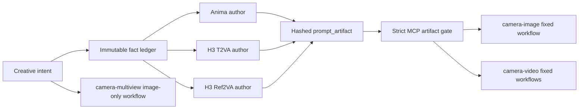

# Architecture

The project has one authoring boundary, two prompt-consuming camera skills,
and one prompt-free fixed multiview consumer.

## Prompt Forge

The LLM extracts intent, builds facts, resolves semantic conflicts, and writes model-native fields. The deterministic package verifies fact coverage, exact offline token counts, dynamic budgets, Anima dictionary protocol, H3 timelines/reference context, lossless compression, artifact status, and canonical hashes.

There are exactly three public authoring paths. No task dispatcher or extensible model layer exists. Prompt Forge contains no workflow nodes, sampler controls, checkpoint knowledge, local LoRA knowledge, seed, GPU, or execution behavior.

The built-in Anima SQLite dictionary and both tokenizer snapshots are immutable release knowledge with source and license manifests. Runtime authoring is offline. Network access exists only in explicit maintainer acquisition tools.

## Artifact gate

The complete `prompt_artifact` is the only prompt input to camera skills. The MCP validator recomputes its hash and validates the expected task/model, production status, token verification, prompt fields, conflict state, sacrificed facts, H3 duration, and Ref2VA reference context. Graph patchers use the same gate before extracting text.

## Camera execution

`camera-image` owns the fixed Anima UI graph, group selection, camera controls, ControlNet, camera runtime LoRA selection, strip-to-API step, and still outputs. `camera-video` owns three hash-locked MiniMax-H3 API graphs, duration, ordered image uploads, and MP4 outputs. These runtime choices do not flow back into Prompt Forge.

`camera-multiview` accepts an empty envelope plus two image paths. Its fixed
Flux2-Klein graph has no prompt patch and therefore no PromptArtifact gate.

The shared MCP engine validates local execution, enqueues the exact graph, waits for terminal history, downloads real outputs, and stores graph/run records with hashes. Validation-only or enqueue-only results are not success.
