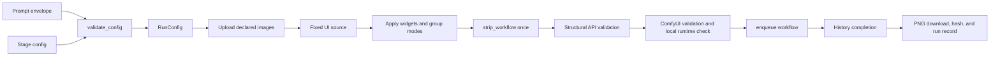

# camera-image canonical flow

This document is the execution contract for the `camera-image` skill. It is
the detailed companion to `skills/camera-image/SKILL.md`.

## 1. First principles

The skill implements one function:

```text
validated semantic config -> valid ComfyUI API graph -> verified PNG artifact
```

The workflow is a compiler pipeline, not a collection of API mutations:



The following invariants are mandatory:

1. One fixed UI source is the runtime authority.
2. Group selection happens before UI-to-API conversion.
3. Configuration is written at the UI widget surface before conversion.
4. The converter owns bypass resolution and connection generation.
5. The final API graph is immutable after conversion.
6. Invalid structure or missing capability stops the run before enqueue.
7. The recorded artifact must be produced by the submitted graph.

## 2. Source assets

| Asset | Authority | Use |
|---|---|---|
| `skills/camera-image/camera_image/runtime/workflow_assets/camera-anima.json` | Runtime source | Complete ComfyUI UI graph, including optional groups |
| `skills/camera-image/workflow/t2i-camera/groups.json` | T2I group contract | G1/G2 title-to-node membership |
| `skills/camera-image/workflow/i2i-camera/groups.json` | I2I group contract | G1/G2 title-to-node membership |
| `camera-anima.api.json` and `camera-anima-shot-image.api.json` | Generated artifacts | Inspection, release integrity, and comparison only; never runtime source |
| `workflow_assets/manifest.json` | Integrity metadata | Source and generated-asset fingerprints |

The source UI is deliberately a superset. A node in a disabled group is not an
error in the source graph. The compiler applies `mode=4` to disabled members;
`strip_workflow` removes them and resolves their bypass connections.

The group contract must remain a valid projection of the fixed UI source:

- every group title must be unique within its G1/G2 bucket;
- every member ID must exist in `camera-anima.json`;
- unknown caller group titles must fail;
- default and stage-mandatory group titles must exist in the group asset.

## 3. Public request contract

The MCP host sends:

```json
{
  "skill": "camera-image",
  "stage": "t2i-camera",
  "envelope": {
    "evidence": {"locked_facts": []},
    "draft": {
      "positive": "1girl, masterpiece, anime portrait",
      "negative": "lowres, bad anatomy",
      "tags": ["1girl", "solo"],
      "structure": [
        {"name": "subject", "text": "1girl"},
        {"name": "action_or_pose", "text": "portrait"},
        {"name": "scene", "text": "cinematic"},
        {"name": "lighting", "text": "cinematic lighting"},
        {"name": "style", "text": "anime style"}
      ]
    },
    "dialect_id": "anima"
  },
  "config": {
    "camera": {"direction": "front", "distance": "medium"},
    "sampling": {"steps_first": 30, "cfg": 4.5},
    "seed": 42,
    "image_size": {"width": 1216, "height": 832},
    "groups": {"g1": [], "g2": []}
  },
  "output_dir": "outputs"
}
```

`draft.positive` and `draft.negative` are non-empty strings. An Anima draft
also supplies exact `tags` and an ordered `structure` covering the required
dialect dimensions. Prompt text passes the Prompt Forge gate before ComfyUI
receives anything. Workflow and execution fields stay in `config`.

`i2i-camera` requires `config.reference_image`. All image config values are
local paths at the public boundary. The engine uploads them and replaces them
with the filenames returned by ComfyUI before graph compilation.

## 4. Group compilation

The enabled set is computed as:

```text
defaults ∪ caller groups ∪ stage-mandatory groups
```

Caller groups add features; they do not disable the required render path.
Dependencies are checked before execution:

| Feature | Required contract |
|---|---|
| I2I | `reference_image` plus the stage image-loading group |
| ControlNet | `controlnet_image` plus `ControlNet LLLite（G1）` |

For each group, the compiler sets all declared member nodes to enabled or
bypassed. It does not edit or delete source nodes outside this selection.

## 5. UI-to-API compilation

`prepare_temporary_workflow` is the `SkillData.prepare_fn` entry point. Its name
is historical; its contract is a pure in-memory compile followed by one MCP
conversion.

The exact sequence is:

1. Load `camera-anima.json` and verify it is a UI workflow.
2. Load the stage `groups.json`.
3. Validate group metadata against the source node IDs.
4. Apply `RunConfig` values to `widgets_values`.
5. Compute the final enabled G1/G2 sets.
6. Set `mode=0` for enabled members and `mode=4` for bypassed members.
7. Call `mcp.strip_workflow(ui_graph)` once.
8. Validate the returned API graph with the structural contract.
9. Return the API graph without any post-strip mutation.

Important bindings are written before strip:

| Semantic input | Source node | UI value |
|---|---:|---|
| Positive prompt | 24 | `wildcard_text` |
| Negative prompt | 25 | `wildcard_text` |
| LoRA stack | 26 | `lora_syntax` |
| First sampling pass | 50 | steps/cfg/sampler/scheduler/denoise |
| Refine pass | 51 | steps/denoise |
| Seed | 65 | seed |
| Width/height | 68/71 | value |
| I2I input | 21 | image filename |
| I2I branch selector | 58 | value `2` |
| ControlNet input | 129 | image filename |
| ControlNet model patch | 592 | graph output to node 131 |

The output path is part of the fixed source topology. The final API graph must
retain the image flow into the designated saver/preview outputs, including the
direct final-image connection from node 111.

## 6. Stage semantics

### T2I

The graph starts from the empty latent branch. Optional LoRA and ControlNet
features are enabled as complete subgraphs. ControlNet must retain both the
control image path and the `ModelPatchLoader` connection into
`AnimaLLLiteApply.model_patch`.

### I2I

The reference image is uploaded first. The compiler writes the image filename
to node 21 and selects the VAE-encoded reference branch before strip. The
compiled API graph must contain:

```json
"27": {"inputs": {"latent_image": ["75", 0]}},
"50": {"inputs": {"denoise": 0.6}}
```

LoRA and ControlNet are independent optional subgraphs and must remain valid
when enabled together.

## 7. Execution and artifact contract

After compilation, `engine.execute.run_skill` performs:

1. Prompt Forge compilation.
2. Ordered stage-image upload.
3. ComfyUI health and queue-idle check.
4. UI compilation through `prepare_fn`.
5. MCP `validate_workflow` on the exact API graph.
6. MCP `check_workflow_runtime`; only the local runtime is accepted.
7. `enqueue_workflow({"workflow": graph})`.
8. Immediate rejection of returned `node_errors`.
9. History polling until completion or timeout.
10. Download of the designated image output.
11. `submitted-graph.json` and `run-record.json` creation.

Success requires all of the following:

- `exit_code == 0`;
- `payload.accepted == true`;
- artifact exists and is non-empty;
- artifact hash is recorded;
- submitted graph exists and matches the validated graph;
- feature-specific graph assertions pass.

No result is inferred from queue-idle state alone.

## 8. Acceptance matrix

The minimum live acceptance set is:

| Case | Required evidence |
|---|---|
| Basic T2I | PNG plus prompt/size/steps/output-path assertions |
| Basic I2I | PNG plus uploaded reference, latent route, denoise, and output assertions |
| T2I + LoRA | PNG plus `LoRA Text Loader (LoraManager)` and `lora_syntax` assertions |
| T2I + ControlNet | PNG plus control image, node 131, node 592, and model-patch assertions |
| T2I + LoRA + ControlNet | PNG plus both complete feature subgraphs |
| I2I + LoRA + ControlNet | PNG plus both feature subgraphs and I2I latent route |


