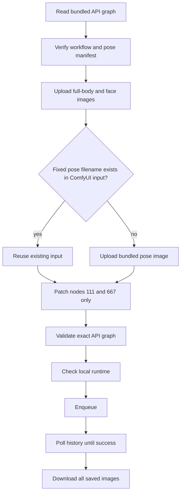

# camera-multiview canonical flow

This document is the executable contract for the `camera-multiview` skill. It
describes one fixed API graph, one fixed pose set, two configurable image
inputs, and one all-artifact result set.

## 1. Authority and scope

The runtime source is the API workflow exported by the user:

```text
skills/camera-multiview/camera_multiview/runtime/workflow_assets/Flux2-Klein人物一键多视图工作流.json
```

The runtime does not search ComfyUI for a workflow and does not convert a UI
workflow. The bundled graph is already in the API prompt shape. It contains
261 nodes and is pinned by:

```text
skills/camera-multiview/camera_multiview/runtime/workflow_assets/manifest.json
```

The pinned workflow SHA-256 is
`33584a54b6587914fce078cdcddbab7915e7d834ca741ded06a44a3ba484252e`.

This is a deliberately closed contract. There are no runtime group toggles.
The only configurable values are the two user image inputs below; every other
workflow value is part of the fixed release asset.

## 2. Public request contract

The MCP lifecycle is:

```text
list_skills
  -> describe_config(skill=camera-multiview, stage=multiview)
  -> validate_config
  -> run_skill
```

This workflow has no prompt input. Its envelope is intentionally empty, and
the only runtime values are the two declared image paths.

```json
{
  "skill": "camera-multiview",
  "stage": "multiview",
  "envelope": {},
  "config": {
    "full_body_image": "E:/images/person-full-body.png",
    "face_image": "E:/images/person-face.png"
  },
  "output_dir": "outputs/camera-multiview"
}
```

`full_body_image` and `face_image` are required local paths. The public config
must not contain groups, LoRA, ControlNet, prompt text, sampler values, seed,
dimensions, or arbitrary workflow JSON.

## 3. Fixed input mapping

The two user inputs are the only graph patches:

| Config key | API node | API field | Required |
| --- | ---: | --- | --- |
| `full_body_image` | `111` | `inputs.image` | yes |
| `face_image` | `667` | `inputs.image` | yes |

The fixed pose files are bundled at:

```text
skills/camera-multiview/camera_multiview/runtime/workflow_assets/pose/
```

The node mapping is fixed and must not be discovered from titles or reordered:

| Pose file | API node |
| --- | ---: |
| `姿势骨架1.png` | `152` |
| `姿势骨架2.png` | `154` |
| `姿势骨架3.png` | `360` |
| `姿势骨架4.png` | `364` |
| `姿势骨架5.png` | `148` |
| `姿势骨架6.png` | `149` |
| `姿势骨架7.png` | `147` |
| `姿势骨架8.png` | `373` |
| `姿势骨架9.png` | `150` |
| `姿势骨架10.png` | `367` |
| `姿势骨架11.png` | `368` |
| `姿势骨架12.png` | `151` |
| `姿势骨架13.png` | `757` |

The manifest pins the SHA-256 of all thirteen files. A changed or missing
asset is an integrity failure, not a reason to substitute another image.

## 4. Execution sequence



The fixed pose hydration is idempotent by filename. The runtime checks
ComfyUI's input view endpoint before uploading a fixed asset. This prevents a
duplicate upload from blocking execution while preserving the filenames used
by the API graph.

The implementation boundary is:

```text
RunConfig
  -> upload two user images
  -> load and verify fixed API graph
  -> hydrate fixed pose filenames
  -> patch nodes 111 and 667
  -> validate API graph
  -> enqueue/history
  -> download all output artifacts
```

There is no UI graph, strip step, temporary save/load round trip, post-strip
repair, or fallback source.

## 5. Invariants and failure boundaries

Before enqueue, all of the following must hold:

1. The workflow file hash and manifest match.
2. The workflow has 261 valid API nodes.
3. Nodes `111` and `667` are the titled `LoadImage` nodes and contain the two
   uploaded filenames.
4. The thirteen pose nodes contain exactly their mapped filenames.
5. The graph passes local MCP workflow validation.
6. The local runtime check succeeds.

After enqueue, success means all of the following, not merely a prompt ID:

1. ComfyUI history reports `success`.
2. Every saved `SaveImage` output is downloaded.
3. Every downloaded artifact has bytes and a SHA-256 record.
4. The submitted graph and run record are written.

The fixed workflow currently has nine `SaveImage` nodes and produces thirteen
saved PNG artifacts. Preview images are not accepted as substitutes for saved
outputs.

## 6. Acceptance evidence

The real acceptance run used the fixed API graph and two local reference
images. It produced:

- `accepted=true` and exit code `0`;
- ComfyUI history status `success`;
- 13 downloaded PNG files;
- node `111` containing
  `2026-08-02-152204_vrChatANIMABASE_v2_640187841478593.png`;
- node `667` containing
  `2026-08-02-152959_vrChatANIMABASE_v2_775259876220101.png`;
- all thirteen pose node values matching this document.

The implementation evidence is recorded in the run directory supplied to the
execution. A successful queue submission without these artifacts is not
completion.

## 7. Diagnosis and change policy

| Symptom | Correct diagnosis boundary |
| --- | --- |
| Manifest/hash failure | Bundled release asset changed; restore or publish a new asset. |
| Fixed pose upload stalls | Check `/view?filename=<name>&type=input`; reuse an existing file. |
| Graph validation fails | Inspect the fixed API source and mapping; do not repair it at runtime. |
| History succeeds but outputs are missing | Inspect all `type=output` history entries and `artifact_mode=all`. |
| A third configurable input is requested | This is a contract change; update source, schema, tests, and docs together. |

Do not add compatibility branches, legacy aliases, alternate workflow lookup,
silent defaults, or graph repair. The next contract version must be a new
fixed asset and an explicit coordinated change.
