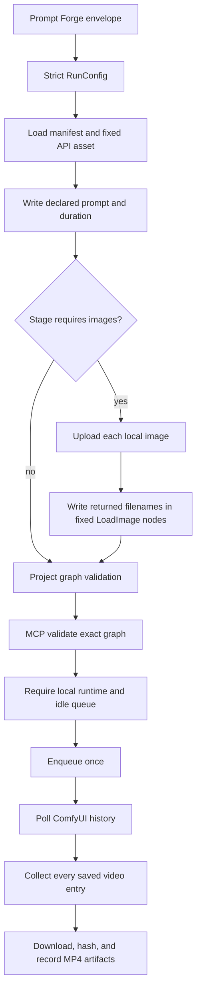

# camera-video canonical flow

This document is the detailed execution contract for
[`camera-video`](../skills/camera-video/SKILL.md). It records the one supported
workflow, configuration surface, transport sequence, acceptance evidence, and
failure boundaries. It is not a second runtime implementation.

## Contents

- [Authority](#authority)
- [Public contract](#public-contract)
- [Fixed graph contract](#fixed-graph-contract)
- [Execution sequence](#execution-sequence)
- [Request examples](#request-examples)
- [Acceptance gate](#acceptance-gate)
- [Failure boundaries](#failure-boundaries)

## Authority

The user supplied three API-format exports. They are the provenance of the
bundled assets; the bundled, hash-locked files are the only runtime authority.

| Stage | Provenance export | Bundled asset | Nodes |
|---|---|---|---:|
| `t2v-video` | `MiniMax H3文生视频.json` | `minimax-h3-t2v.json` | 17 |
| `i2v-video` | `MiniMax H3单图参考生视频.json` | `minimax-h3-i2v-single.json` | 18 |
| `multi-i2v-video` | `MiniMax H3多图参考生视频.json` | `minimax-h3-i2v-multi.json` | 20 |

The assets and their hashes are declared in:

```text
skills/camera-video/camera_video/runtime/workflow_assets/manifest.json
```

The runtime loads the selected API JSON directly. It never searches the local
ComfyUI workflow library, imports a UI graph, converts a workflow, saves a
temporary workflow, or selects an alternate source.

### Release normalization

Normalization happened once while preparing the release asset, not during a
run:

1. Remove the isolated `UniBlockSwap` node from each export. It had no outgoing
   dependency and no usable model input, so it was not part of the executable
   graph.
2. Remove `MiniMaxH3MemoryEfficientSageAttentionPatch` from the single- and
   multi-reference assets and connect the fixed LoRA node to the original model
   path. This node is an optional performance optimization whose availability
   depends on the exact SageAttention, CUDA, PyTorch, and ComfyUI-KJNodes
   environment; it is not a video-generation semantic input.

After normalization, the manifest hash is the release identity. A changed
hash is a new source asset and must be reviewed and released as such. The
runtime does not reconstruct, repair, or downgrade a graph when a dependency
is absent.

The `ComfyMathExpression` node's `values.a` key is ComfyUI V3 autogrow input
notation and remains part of the fixed API graph. A validator that does not
understand this notation is a transport/tool-version failure; do not rewrite
the graph to satisfy it.

## Public contract

The public MCP stages and fields are deliberately minimal:

| Stage | Required fields | Forbidden fields |
|---|---|---|
| `t2v-video` | `prompt`, `duration` | all image fields, groups, LoRA, ControlNet, model/sampler overrides |
| `i2v-video` | `prompt`, `duration`, `reference_image_1` | `reference_image_2`, `reference_image_3`, groups, LoRA, ControlNet, model/sampler overrides |
| `multi-i2v-video` | `prompt`, `duration`, `reference_image_1`, `reference_image_2`, `reference_image_3` | groups, LoRA, ControlNet, model/sampler overrides |

Configuration rules:

- `prompt` must be a non-empty string.
- `config.prompt` is compiled by the fixed `minimax_h3` Prompt Forge dialect;
  the envelope has no second prompt source.
- `prompt` follows the canonical contract in
  [`skills/prompt-forge/references/minimax-h3.md`](../skills/prompt-forge/references/minimax-h3.md):
  its header duration equals `config.duration`, and its ordered `@图片N`
  prefix declares exactly the images required by the selected stage.
- `duration` must be finite and in the inclusive range 2–15 seconds.
- Each required reference image must be a local path and must upload
  successfully.
- Extra fields and unused reference fields are rejected.
- No group is configurable; the graphs contain no stage-selection group
  contract.

## Fixed graph contract

Only the following values are request inputs. Every model, LoRA, seed,
resolution, sampler, audio option, codec option, connection, and output
setting is fixed by the bundled graph.

| Stage | Prompt input | Duration input | Reference-image inputs | Output node |
|---|---|---|---|---|
| `t2v-video` | node `234.value` | node `236.value` | none | node `303` `VHS_VideoCombine` |
| `i2v-video` | node `312.value` | node `323.value` | node `335.image` | node `329` `VHS_VideoCombine` |
| `multi-i2v-video` | node `339.value` | node `350.value` | nodes `362.image`, `364.image`, `365.image` | node `360` `VHS_VideoCombine` |

The multi-image order is strict:

```text
reference_image_1 -> node 362 -> ref_image_0
reference_image_2 -> node 364 -> ref_image_1
reference_image_3 -> node 365 -> ref_image_2
```

The graph compiler creates a deep copy, writes those fields, validates the
resulting node topology, and returns it. It performs no other graph mutation.

## Execution sequence



The shared engine performs these boundaries in order:

1. Compile the Prompt Forge envelope.
2. Upload every declared stage image. Require a returned ComfyUI filename;
   never guess an input-directory path.
3. Require the ComfyUI queue to be idle.
4. Load the fixed asset, apply the strict configuration, and validate the
   project-owned graph contract.
5. Call MCP `validate_workflow` on that exact graph.
6. Call `check_workflow_runtime` and require the local runtime.
7. Call `enqueue_workflow` with exactly `{"workflow": graph}` and reject
   returned node errors.
8. Poll `history/<prompt_id>` until success, execution error, or timeout.
9. Collect all saved entries from the history `gifs` field, download them, and
   record byte count and SHA-256.

The internal `gifs` label is a VideoHelperSuite convention. The actual saved
media is MP4 from `VHS_VideoCombine`. A prompt ID, an idle queue, or a
successful enqueue is not an accepted result.

## Request examples

Every request uses the same envelope/config shape. The envelope carries only
the evidence ledger. `config.prompt` is the sole video prompt source and is
compiled by the fixed `minimax_h3` Prompt Forge dialect; `envelope.draft` and
caller-selected dialects are forbidden.

### Text-to-video

```json
{
  "skill": "camera-video",
  "stage": "t2v-video",
  "envelope": {
    "evidence": {"locked_facts": []},
    "draft": {},
    "dialect_id": "minimax_h3"
  },
  "config": {
    "prompt": "生成一段4秒、16:9、2K、原生立体声的MiniMax H3电影级文戏短片。\n核心概念：一名旅人因听见钟声而停下，并最终决定走向庭院出口。\n人物与场景锁定：固定同一名旅人、浅色外套、石砌庭院、出口方位与午后暖光。\n时间线：\n0—0.8秒：旅人沿石径前行，远处钟声触发他放慢脚步。\n0.8—1.6秒：他停下并转头寻找声源，衣摆随惯性落定。\n1.6—2.4秒：他看见出口处光线变化，呼吸放缓并作出决定。\n2.4—3.2秒：他转正身体，迈向出口，影子沿石径移动。\n3.2—4秒：他抵达出口前并抬头，画面完整落在坚定神情。\n摄影与剪辑：按钟声、视线与转身因果切镜，保持行进方向和庭院轴线连续。\n视觉风格：电影级写实质感，暖色自然光、细腻石材纹理与克制浅景深。\n声音设计：原生立体声呈现脚步、衣料、庭院风声与远处钟声。\n结尾结果：最后一秒完整呈现旅人走到出口并确认方向的结果。",
    "duration": 4
  },
  "output_dir": "outputs/camera-video"
}
```

### Single-image reference-to-video

```json
{
  "skill": "camera-video",
  "stage": "i2v-video",
  "envelope": {
    "evidence": {"locked_facts": []},
    "draft": {},
    "dialect_id": "minimax_h3"
  },
  "config": {
    "prompt": "@图片1作为人物身份、服装与庭院场景参考\n生成一段4秒、16:9、2K、原生立体声的MiniMax H3电影级文戏短片。\n核心概念：参考人物因听见钟声而停下，并最终决定走向庭院出口。\n人物与场景锁定：固定图片1中的人物身份、服装、庭院构图、出口方位与傍晚光线。\n时间线：\n0—0.8秒：人物承接参考姿态前行，远处钟声触发其放慢脚步。\n0.8—1.6秒：人物停下并转头寻找声源，服装随惯性自然落定。\n1.6—2.4秒：人物看见出口处光线变化，呼吸放缓并作出决定。\n2.4—3.2秒：人物转正身体迈向出口，保持面部和服装稳定。\n3.2—4秒：人物抵达出口前并抬头，画面完整落在坚定神情。\n摄影与剪辑：按钟声、视线与转身因果切镜，保持行进方向和庭院轴线连续。\n视觉风格：延续图片1的写实质感与傍晚色彩，保留材质细节和空间层次。\n声音设计：原生立体声呈现脚步、衣料、庭院风声与远处钟声。\n结尾结果：最后一秒完整呈现人物走到出口并确认方向的结果。",
    "duration": 4,
    "reference_image_1": "E:/images/subject.png"
  },
  "output_dir": "outputs/camera-video"
}
```

For `multi-i2v-video`, add `reference_image_2` and `reference_image_3`, and
begin the prompt with ordered declarations for `@图片1`, `@图片2`, and
`@图片3`. All three image fields are required; there is no image reuse or
missing-image default.

## Acceptance gate

Accept a run only when every condition holds:

- the requested stage is registered and its config is valid;
- the H3 production header, duration, flow, labeled sections, timeline, and
  image-reference prefix pass Prompt Forge validation;
- the selected asset exists and matches the manifest hash;
- the exact graph passes project validation, MCP validation, and local runtime
  checks;
- the submitted graph contains the requested prompt and duration at the
  declared node IDs;
- every required `LoadImage` node contains the filename returned by its upload;
- ComfyUI history reports successful execution with no node error;
- every saved MP4 is downloaded, non-empty, and recorded with byte count and
  SHA-256;
- the submitted graph and run record are persisted.

Offline tests must cover asset hashes, node mappings, stage descriptions,
duration bounds, unknown fields, and image requirements. Live acceptance must
produce actual MP4 files for all three stages; validation-only or enqueue-only
evidence is insufficient.

## Failure boundaries

| Failure | Owning boundary | Required action |
|---|---|---|
| Unknown field, missing prompt, invalid duration | camera-video config schema | Reject the request |
| Missing/changed asset or manifest hash | release asset integrity | Stop; review and release a new asset |
| Image upload has no returned filename | MCP upload boundary | Stop before enqueue |
| Missing node type/model/custom node | local ComfyUI runtime | Report the dependency; do not substitute a graph |
| Validator rejects `values.a` | incompatible MCP validator | Use the project MCP contract; do not rewrite the asset |
| SageAttention patch unavailable | optional release-time optimization | Use the released graph; do not add a runtime branch |
| ComfyUI node error, timeout, or missing artifact | execution/artifact boundary | Report the real error; do not claim success |

The virgin-principle rule is simple: one public schema, one fixed graph per
stage, one execution path, and no backward-compatibility layer. Any intentional
workflow change must update the source export, release asset, manifest,
schema, tests, and these documents together.
