# Prompt Forge 处女式重构设计

> 文档状态：重构设计基线  
> 日期：2026-08-12  
> 设计范围：Anima 生图、MiniMax H3 生视频  
> 优先级：生成质量 > 模型原生性 > 可验证性 > 易用性 > 实现成本  
> 核心约束：不补丁、不兼容、不迁移旧抽象，不以旧代码形状限制新设计

## 0. 执行结论

Prompt Forge 应当被重建为一个“模型原生的创作与审片技能”，而不是一个把概念对象投影成字符串的脚本编译器。

最终决策如下：

1. **彻底废弃旧 Prompt Forge。** 不保留 v3 schema、31 个 projector、P1–P5 词法门禁、alias registry、兼容 envelope 或旧接口适配层。
2. **首版只支持项目真实生产目标。** 即 Anima 图像工作流与 MiniMax H3 的 T2VA / Ref2VA 工作流。没有经过权威资料绑定和渲染评测的模型不得以“通用方言”名义启用。
3. **LLM 是创作者和审片者。** 它负责理解意图、视觉设计、镜头设计、模型原生写作、反向审查和最终改稿；确定性代码只验证客观契约。
4. **脚本仍有必要，但数量很少。** H3 需要严格语法 lint；Anima 只需要轻量标签 lint；另有 profile 完整性和评测数据校验。脚本不得生成创意内容、自动补词或用字数替代质量。
5. **模型方言必须绑定到精确产物。** 方言不是 `anima` 或 `minimax_h3` 这样的宽泛名称，而是“模型家族 + 精确 checkpoint + 任务模式 + 输入资产角色 + prompt 影响型 LoRA/适配器 + 固定 workflow”的组合。
6. **生产入口 fail closed。** 找不到精确方言、来源文件、workflow 任务类型或 prompt-affecting adapter 信息时，停止生成，不回退到“最接近”的模型家族。
7. **提示词质量不能由脚本宣告。** `lint_passed` 只表示格式可提交；只有通过模型渲染基准与人工盲评的 profile 才能标记为 `production_verified`。
8. **新旧切换是一次性原子替换。** 新技能、新消费契约、测试和文档在独立目录构建并验收；切换时删除旧实现并同时更新 camera-image / camera-video，不双写、不双读、不留兼容期。

## 1. 为什么要推倒重来

### 1.1 当前实现的问题不是“小缺陷”，而是产品定义错位

现有实现同时声称：

- LLM 编写 typed concept objects；
- 脚本把概念对象投影成 31 种模型提示词；
- Prompt Forge 是 LLM-first；
- camera skill 只传一段 `scene_brief`；
- 文档引用模型方言知识文件。

这些说法彼此不一致。实际代码把整段 brief 塞进 `Subject.identity`，视频还会虚构 `opening shot of the scene` 和固定时长，再由 projector 拼接成文本。所谓“typed scene understanding”并未发生。

更严重的是，模型知识与真实运行目标已经发生偏离：

- 当前 SKILL 把 Anima 描述为“Qwen3 DiT、自然语言优先”，而官方模型卡说明它是基于 Cosmos-Predict2 的 2B 图像模型，训练语料同时包含 Danbooru 标签、自然语言 caption 和混合形式。
- 项目文档引用 `references/anima.md` 与 `references/minimax-h3.md`，源码中这两个文件并不存在。
- 本地 Anima 工作流并非官方 `anima-base-v1.0`，而是 `miaomiaoHarem_anima15.safetensors`，并叠加多个 prompt-affecting LoRA/trigger；仅写一个 `dialect_id: anima` 无法表示真实目标。
- 本地 H3 的 `t2v-video` 工作流节点明确使用 `task_type: T2VA`，而 `i2v-video` 与 `multi-i2v-video` 都明确使用 `task_type: Ref2VA`。现有中文段落式模板没有采用 H3 官方 T2VA 三段结构，也没有采用 Ref2VA 六段结构。
- 工作流把分辨率、时长、音频模式放在独立节点中，但现有 prompt 仍写“2K、原生立体声、X 秒”，造成文本与真实运行参数双重来源，甚至可能互相冲突。

因此，继续修 projector、增加 regex 或补引用文件只会固化错误边界。

### 1.2 旧设计必须整体删除的部分

以下概念不进入新系统：

- `Specification / State / Transition / Constraint` 旧数据类；
- 31 个模型通用 registry；
- 宽泛 alias，例如把多个版本都映射到 `anima`、`wan` 或 `flux`；
- `project.py` 式确定性创意拼装；
- 以 token 出现次数验证“连续性”；
- 固定最小字数、固定 200+ words、抽象词黑名单；
- 统一的负面词模板；
- “所有视频都用时间段 + Hollywood opener”的伪通用法；
- 旧 `PromptPackage`、旧 envelope 和兼容字段；
- 从旧 schema 到新 schema 的 adapter 或 migration；
- 缺少精确 profile 时的 family fallback。

## 2. 调研结论与案例分析

### 2.1 Anima 官方方法论

[Anima 官方模型卡](https://huggingface.co/circlestone-labs/Anima)给出的关键信息是：

- Anima 是 CircleStone Labs 与 Comfy Org 合作的 2B 文生图模型，主要面向 anime、illustration 和其他非写实艺术，不擅长照片级写实。
- 官方 Base 1.0 使用 `anima-base-v1.0.safetensors`、Qwen3 0.6B text encoder 与 Qwen-Image VAE；推荐 512²–1536²、30–50 steps、CFG 4–5。
- 训练输入同时包含 Danbooru 风格标签、自然语言 caption 和二者混合。
- 标签使用小写和空格；只有 `score_7` 这类 score 标签保留下划线。
- 推荐正向前缀是质量、分数和安全标签；推荐负向以低质量分数与 `artist name` 为主。
- 推荐标签顺序是：质量/元信息/年份/安全 → 人数性别 → 角色 → 作品 → 画师 → 一般标签。
- 画师标签需要 `@`；Prompt weighting 可用，但通常需要比 SDXL 更高的权重才明显。
- 纯自然语言应足够具体，官方建议至少两句；多角色场景不能只列角色名，还要逐个描述基本外观。
- 模型训练时使用 tag dropout，因此不需要穷举画面里每个标签。
- Base 是真正的基础模型，默认审美偏中性；不提供明确风格时，结果可能平淡。

这些事实推翻了两个常见误区：

1. Anima 不是“纯 tag 模型”，也不是“纯自然语言模型”；最佳输入形态应由场景复杂度和 checkpoint 实测决定。
2. 高质量不是堆叠 `masterpiece, 8k, HDR, cinematic`，而是用稳定标签表达离散视觉属性，用自然语言表达标签难以表达的空间关系、角色互动、构图因果和材质光线。

### 2.2 项目实际 Anima 不是官方 Base

固定工作流当前加载：

- checkpoint：`miaomiaoHarem_anima15.safetensors`；
- text encoder：`qwen_3_06b_base.safetensors`；
- VAE：`qwen_image_vae.safetensors`；
- sampler：`er_sde`；
- steps：30；
- CFG：4；
- 多个额外 LoRA 与自动 trigger。

公开的 MiaoMiao Harem Anima 资料说明该分支基于 Anima Base 1.0，支持纯标签、自然语言和混合写法，并为该微调版提供不同于 Base 的质量前缀建议。这个资料可以作为次级证据，但本地文件名 `anima15` 仍不足以唯一确认具体版本、文件哈希和模型卡版本。

结论：新技能不能把 Base 1.0 的规则直接当作本地 checkpoint 的完整规则。必须建立两层知识：

- `anima.base-1.0`：官方、可追溯的基础方言；
- `anima.miaomiao-harem.anima-1.5.<sha256>`：本地 checkpoint overlay，只有完成哈希绑定和项目实测后才能启用。

LoRA trigger 不写进模型家族方言。它们是运行时 overlay，由 camera-image 根据实际启用的 LoRA 清单显式传入。

### 2.3 MiniMax H3 官方方法论

[MiniMax H3 官方仓库](https://github.com/MiniMax-AI/MiniMax-H3)与[官方发布说明](https://minimaxi.com/blog/minimax-h3)显示：

- H3 是统一理解文本、图片、视频和声音的全模态生成系统，可生成原生双声道音视频，最长 15 秒；完整系统包含 Context-IR、H3 Base 和 2K regeneration。
- 官方明确指出 Context-IR 对最终质量至关重要，并建议本地部署者按 Prompting Guidance 自建上下文处理系统。
- H3 的语言不是普通“电影感长段落”，而是面向任务模式的中间表示。
- Base guide 覆盖 T2VA、I2VA、FL2VA、L2VA；Full-reference guide 覆盖 Ref2VA。
- 官方还发布了独立的 [H3 prompt-writing skill](https://github.com/MiniMax-AI/MiniMax-H3/blob/main/skills/h3-prompt-writing/SKILL.md)。这个 skill 本身没有创作脚本，只负责识别模式、读取对应 guide、保持字段名、顺序、标签与时间语法。

这给 Prompt Forge 一个非常直接的设计信号：H3 质量核心是**正确构造 Context-IR 风格的模型原生文本**，不是增加更多通用视频修辞。

### 2.4 H3 Base 模式的官方结构

T2VA 直接输出三个字段，顺序固定：

```text
integrated_multimodal_description: ...

overall_soundscape: ...

non_diegetic_music: ...
```

I2VA、FL2VA、L2VA 在三个字段之前增加各自精确的关键帧对齐指令。共同规则包括：

- `[Shot 1]` 没有时间戳；后续镜头以严格递增的切镜时间开始。
- 时间戳描述切镜点，不是把整个视频机械切成 `[0–2s]` 时间块。
- 一个 cut 必须带来新信息；轻微距离或角度变化应优先使用镜头运动。
- 镜头运动表达为“运动类型 + 必要时的幅度 + 必要时的速度”，并自然写入镜头描述。
- 发声角色使用稳定 `(S1)`、`(S2)` ID。
- 对白使用 `<d>[Language] 原文</d>`，必须逐字保留用户原文；对白之外描述角色、语气和动作。
- 画外音要明确是 off-screen voiceover，并说明画面中角色嘴唇保持闭合。
- 可见文字用英文双引号包裹并保留原文。
- `overall_soundscape` 只总结环境声、物理声和非语言人声，不重复对白或演唱。
- `non_diegetic_music` 只描述角色听不到的配乐，聚焦乐器、速度、节奏和动态变化；无配乐时写 `N/A`。

### 2.5 H3 Ref2VA 的官方结构

Ref2VA 使用六个字段，顺序固定：

```text
subject_definitions:
...

summary:
...

retention_analysis:
...

detailed_description:
...

overall_soundscape:
...

non_diegetic_music:
...
```

其核心不是“@图片1 作为人物参考”，而是先定义资产语义：

- `<Subject N>`：从参考资产抽象出的可复用人物、物体、场景、服装、动作或风格；
- `<Picture N>`：作为首帧、尾帧、关键帧或构图锚点的具体图片；
- `<Video N>`：被编辑、续写或提供整体时序结构的参考视频；
- `<Audio N>`：被复制或参考的音频信号。

随后用固定 retention marker 说明每个引用项是完整保留、部分保留、属性迁移还是弱参考。标签在六段中必须含义稳定，不能一张图片在不同段落里一会儿代表人物、一会儿代表整张构图。

### 2.6 本地 H3 工作流的真实映射

| 项目 stage | 工作流节点 `task_type` | 必须使用的 H3 方言 | 参考输入 |
|---|---|---|---|
| `t2v-video` | `T2VA` | Base 三字段 | 无 |
| `i2v-video` | `Ref2VA` | Full-reference 六字段 | 1 张图 |
| `multi-i2v-video` | `Ref2VA` | Full-reference 六字段 | 3 张图 |

因此，路由必须读取固定 workflow manifest 的 `task_type`，不能根据 stage 名字里的 `i2v` 猜测为官方 I2VA。

这也是当前质量问题中最重要的一项：现有单图和多图模板虽然很长，但语法属于自创中文剧本，不是本地节点以 `strict_prompt_tags: true` 运行时期待的 Ref2VA 表达。

### 2.7 其他优秀官方方法论提供的共同原则

其他模型的官方指南只用来提炼跨模型原则，不直接进入 Anima/H3 方言：

- [FLUX.2 Prompting Guide](https://docs.bfl.ai/guides/prompting_guide_flux2)：先说主体与动作，再说风格、环境、构图和光线；用具体可见描述替代抽象品质词。
- [Google Imagen Prompt Guide](https://docs.cloud.google.com/vertex-ai/generative-ai/docs/image/img-gen-prompt-guide)：主体、上下文和风格是基础三元组，复杂需求应通过迭代和可观察属性表达。
- [Google Veo Prompt Guide](https://docs.cloud.google.com/vertex-ai/generative-ai/docs/video/video-gen-prompt-guide)：视频需显式覆盖主体、动作、场景、镜头、时间和音频。
- [Runway Image-to-Video Guide](https://help.runwayml.com/hc/en-us/articles/31192457907731-Image-to-Video-Prompting-Guide)：参考图已经提供静态视觉事实，文本应优先描述运动、镜头和变化。

可复用的原则只有四条：

1. 写可见、可听、可运动的事实。
2. 把资产已提供的信息与文本需要补充的信息分开。
3. 先选任务模式，再写模型方言。
4. 质量来自明确关系与有意取舍，不来自形容词数量。

### 2.8 官方案例透露出的质量机制

#### Anima：完整 tag 案例为什么有效

Anima 官方模型卡的完整标签案例并没有先写一段“电影级、8K、令人惊叹”的文案，而是依次给出年份/质量/安全、人物数量、角色与作品、画师标签，再进入发色、服装、动作、表情、手持物和背景。这种写法的价值不是“标签越多越好”，而是**每个离散属性都有稳定语义，且先建立身份再添加局部属性**。

可迁移的经验：

- 质量和安全标签是 conditioning 前缀，不是审美内容本身；
- 角色名之后仍描述基本外观，防止模型只依赖知识记忆；
- 动作、道具和背景是独立视觉事实；
- tag dropout 意味着应删掉低价值同义词，而不是穷举；
- 多角色 prompt 需要比官方单角色例子更强的归属表达，因此 hybrid 模式更合理。

#### H3 T2VA：官方星舰案例为什么有效

H3 官方 README 的 T2VA 示例以一个星舰舰桥镜头开始，先建立构图、人物位置、窗外舰队和光线，再让舰队蓄能；后续在明确切镜时间进入人物近景，并让闪光、船体震动、人物失衡和反应形成同一因果链。环境声段负责机械低鸣、蓄能声和冲击声，配乐段单独负责乐器与动态。

它的关键不是篇幅，而是：

- 画面变化、镜头变化和声音变化共享同一时间因果；
- cut 引入了人物反应这一新信息；
- 物理声没有混进 non-diegetic music；
- 结尾落在舰队消失后的可见状态，而不是“营造震撼氛围”。

#### H3 I2VA：官方拉面案例为什么有效

官方 I2VA 示例没有只写“蒸汽上升、镜头推近”。它先完整锚定首帧中的拉面、桌面物体、家人位置和景深，再把主要变化设计成持续蒸汽与焦点从前景转向背景，最后让背景人物活动进入清晰区域。说明对 H3 来说，I2VA 的运动描述必须建立在**首帧事实守恒**之上。

这条经验不能直接套到本地 `i2v-video`，因为本地节点实际是 Ref2VA；但它证明了参考图任务不能只写 motion，也不能把参考图当作一句宽泛的 style hint。

#### H3 Ref2VA：官方多模态案例为什么有效

官方 Ref2VA 示例先把人物、源视频、背景音乐和音色分别定义，再声明编辑、音频复用与音色参考的任务组合；retention 分析逐项说明哪些内容被完整保留、哪些只被参考；最后才写播放时间线。这样可以阻止“人物来自图片、动作来自视频、声音来自音频”在长 prompt 中互相串位。

这正是本地三图工作流最需要的能力：三张图片可能分别代表女主、场景和男主，不能只靠 `@图片1/@图片2/@图片3` 在剧本段落中反复点名。

## 3. 新产品定义

### 3.1 Prompt Forge 是什么

Prompt Forge 是一个无副作用的创作技能，负责：

1. 识别目标模型的精确方言；
2. 把用户意图整理为模型需要的视觉或视听计划；
3. 按模型原生格式编写提示词；
4. 进行独立的语义审片；
5. 运行客观格式 lint；
6. 输出可追溯的 Prompt Artifact。

它不负责：

- ComfyUI 健康检查；
- 模型、节点或依赖发现；
- workflow patch；
- sampler、CFG、steps、分辨率、seed 等执行参数；
- 文件上传、排队、轮询和下载；
- 自动选择 LoRA；
- 用脚本生成创意文本。

### 3.2 “模型方言”的精确定义

新系统中：

```text
Dialect = Model Family
        + Exact Checkpoint Identity
        + Task Mode
        + Input Asset Roles
        + Prompt-affecting Adapter Set
        + Workflow Prompt Contract
```

示例：

```text
anima.miaomiao-harem.anima-1.5.<model-sha>
  + operation=t2i
  + lora-set=<ordered-trigger-manifest-sha>
  + workflow=camera-anima.<workflow-sha>
```

```text
minimax-h3.base.t2va
  + workflow=minimax-h3-t2v.<workflow-sha>
```

```text
minimax-h3.base.ref2va
  + assets=picture[1..3]
  + workflow=minimax-h3-i2v-multi.<workflow-sha>
```

`anima` 和 `minimax_h3` 不再是可提交的 production ID。

### 3.3 生产状态

每个精确方言只有三种状态：

| 状态 | 含义 | 能否进入相机技能 |
|---|---|---|
| `draft` | 有资料，尚未完成 lint 与样例审查 | 否 |
| `benchmarking` | 已可写 prompt，正在跑固定渲染基准 | 否 |
| `production_verified` | 来源、语法、渲染和盲评均达到阈值 | 是 |

没有 `best_effort`、`legacy`、`deprecated-but-supported` 或 family fallback。

## 4. 端到端创作流程

```mermaid
flowchart LR
    A["用户意图与参考资产"] --> B["精确目标绑定"]
    B --> C["创作简报与假设账本"]
    C --> D["模式专属视觉/视听规划"]
    D --> E["模型原生初稿"]
    E --> F["客观语法 lint"]
    F --> G["独立语义审片"]
    G --> H["作者定向重写"]
    H --> I["最终 lint 与证据映射"]
    I --> J["Prompt Artifact"]
    J --> K["固定 workflow 渲染评测"]
```



### 4.1 Step 0：精确目标绑定

输入必须包含：

- camera stage；
- workflow ID 与 hash；
- workflow 声明的 task type；
- checkpoint 文件名与 SHA-256；
- text encoder / conditioning 类型；
- prompt 槽数量与语义；
- 参考资产数量、类型和顺序；
- 所有 prompt-affecting LoRA、trigger 和权重；
- duration 等独立执行参数的已知值，但这些值只用于检查 prompt 时间线，不写回执行配置。

任何关键项缺失都停止。Prompt Forge 不自行扫描模型目录，也不猜 checkpoint。

### 4.2 Step 1：创作简报与假设账本

LLM 把请求整理成一个轻量 brief，而不是旧式庞大概念对象：

```yaml
creative_brief:
  intent: 用户真正想获得的画面或视频结果
  operation: t2i | i2i | t2va | ref2va
  subject_facts: 必须出现的主体事实
  action_or_change: 动作、状态变化或编辑目标
  setting: 场景与空间关系
  composition_or_shots: 构图或镜头计划
  style: 媒介、审美、时代与质感
  lighting: 有方向和来源的光线
  audio: 对白、环境声、物理声、配乐
  visible_text: 必须逐字保留的画面文字
  hard_constraints: 不得改变的事实
  exclusions: 明确不希望出现的结果
  assumptions: LLM 为补全创作所作的可撤销假设
```

只保留会改变最终作品的字段。没有内容时不造空对象。

### 4.3 Step 2：模式专属规划

Anima 规划的是一张最终画面：

- 视觉主角是什么；
- 观看顺序是什么；
- 主体、动作、环境、镜头、光线如何形成一个清晰画面；
- 哪些信息适合 tag，哪些关系必须用自然语言；
- i2i 时参考图已经提供什么，文本只需要改变什么。

H3 规划的是完整视听时间线：

- 每个 shot 引入什么新信息；
- 动作如何从前一状态连续发展到结果；
- 镜头运动是否必要；
- 对白能否在时长内自然完成；
- 哪些声音是当前镜头内的事件，哪些是全局 ambience，哪些是非叙事配乐；
- Ref2VA 中每个资产到底是 Subject 还是 Picture，以及保留关系是什么。

### 4.4 Step 3：模型原生初稿

作者只读取当前精确方言的：

- 一份 concise authoring contract；
- 一份完整官方/项目参考；
- 2–4 个经过渲染验证的 few-shot 示例；
- 当前 brief 与资产角色清单。

不得把其他模型的写法混入当前方言。例如：

- 不给 Anima 套 FLUX 长段落模板；
- 不给 H3 套 Danbooru 标签；
- 不给 H3 Ref2VA 使用 `@图片1` 私有语法；
- 不把 Runway 的“只写 motion”原则机械套到需要六段引用分析的 H3 Ref2VA。

### 4.5 Step 4：客观语法 lint

先消除机器可判定错误，避免 reviewer 在错误格式上浪费精力。lint 失败时作者根据错误码自行重写，脚本不修改文本。

### 4.6 Step 5：独立语义审片

Reviewer 不读取作者的推理，只读取：

- 用户原始请求；
- 参考资产分析；
- 精确方言 contract；
- 初稿 prompt；
- lint 报告。

Reviewer 必须从以下角度找“会导致坏片/坏图的问题”，而不是润色文风：

- 是否遗漏关键意图；
- 是否发明不应出现的人物、物体、对白或镜头；
- 是否有空间、身份、服装、道具或时间矛盾；
- 是否把执行参数写进 prompt；
- 是否超过模型/时长可承载的信息量；
- 是否存在模型方言错误；
- 是否有更直接、更可视化的表达；
- 是否出现模板化审美词挤占注意力。

每条意见必须带 `severity`、问题位置、失败机制和具体改法。Reviewer 不直接改稿。

### 4.7 Step 6：定向重写与最终审计

作者只处理 reviewer 的有效问题，保留用户意图。随后重新 lint，并生成约束证据映射：

```yaml
constraint_evidence:
  - constraint: 女主始终穿朱红色外套
    evidence: "..."
    location: detailed_description / Shot 1 and Shot 3
```

证据映射不是 token 搜索结果，而是 LLM 指明最终文本中哪一处实现了约束；lint 只检查 location 是否存在。

## 5. Anima 方言设计

### 5.1 支持的精确 profile

首版只建立：

1. `anima.base-1.0`：官方 Base 1.0 参考 profile，用于研究与对照；
2. `anima.miaomiao-harem.anima-1.5.<sha256>`：项目 camera-image 的唯一 production candidate；
3. 运行时 `adapter_overlay`：按固定工作流实际启用的 LoRA 和 trigger 顺序生成，不是独立可选方言。

在本地 checkpoint SHA、原始模型卡版本和 trigger 行为未确认前，第 2 项必须保持 `benchmarking`。

### 5.2 Anima 不是一种固定长度

Anima composer 允许三种原生表达模式：

| 模式 | 使用场景 | 结构 |
|---|---|---|
| `tag` | 单主体、离散属性明确、角色/服装/动作简单 | 严格排序的精炼 tag 序列 |
| `natural` | 复杂艺术描述、关系与氛围远多于角色标签 | 质量前缀 + 至少两句具体英文描述 |
| `hybrid` | 多角色、复杂互动、明确构图与光线 | 稳定 tag 骨架 + 关系型自然语言 |

具体 checkpoint 的默认模式由渲染 benchmark 决定。对当前 MiaoMiao Anima candidate，设计默认从 `hybrid` 开始验证，而不是预先宣布它一定最好。

### 5.3 推荐的 tag 骨架

```text
[quality/meta/year/safety]
[subject count and gender]
[character identity and series]
[stable appearance and wardrobe]
[pose/action/expression/gaze]
[props and interaction]
[environment and spatial layout]
[shot/composition/lighting]
[style or user-requested artist tags]
```

规则：

- Danbooru/Gelbooru 标签小写、空格分词；score 标签保留下划线。
- 多角色时，每个角色先有稳定身份，再有各自外观、位置与动作；不能把所有属性放进一个无归属 tag 池。
- 角色互动、遮挡、左右关系、前后景和因果动作优先用自然语言补充。
- 质量标签只使用 profile 验证过的一组，不把同义词堆满开头。
- 年份、时代和安全标签只在有意控制时写入。
- 画师标签只有用户明确要求，或项目拥有明确授权的 style recipe 时才使用；系统不得自动发明画师名。
- 权重只用于 benchmark 证明存在注意力竞争的关键概念。权重范围由精确 checkpoint profile 声明，不沿用 SDXL 默认经验。
- 不穷举无关细节；利用 tag dropout 训练特性，把注意力留给视觉主线。

### 5.4 Hybrid 写法

Hybrid prompt 由两层组成：

```text
<ordered tag backbone>

<one or more precise English sentences for relationships, composition, material, and lighting>
```

自然语言只承担标签表达不好的信息。例如：

- 两个人谁在前、谁在后；
- 谁的手握住谁的手腕；
- 镜子里反射谁而不是生成第三个人；
- 主光从哪来、落在什么材质上；
- 画面视觉焦点与前中后景关系。

它不是把 tag 再翻译一遍，避免重复占用注意力。

### 5.5 i2i 与区域提示

`i2i-camera` 不使用“完整重述原图”的默认策略。先把参考资产拆成：

- `preserve`：身份、构图、服装、场景等必须保留的事实；
- `change`：用户明确要求改变的内容；
- `free`：模型可以重新解释的内容。

最终 prompt 描述目标结果，并把最关键 preserve 锚点保留在 tag 骨架中。参考图路径、文件名和“参考图片1”不写进 prompt。

区域提示是独立的小型目标描述：

- 继承全局主体身份和风格，不重复整套质量前缀；
- 只写该区域独有的人物/材质/颜色/动作；
- 三个区域之间不得出现身份或颜色冲突；
- 如果 region mask 不启用，不生成 region prompt。

### 5.6 Anima negative

默认从官方推荐基线开始：低质量等级和 artist-name 抑制。其他 negative 只基于已观察失败添加。

禁止：

- 跨模型复制几百项 negative；
- 默认加入 embeddings 名称；
- 正向要求与负向词冲突；
- 用 negative 修复本应在正向明确的主体数量、构图或动作；
- 把用户需要的可见文字默认全部否定。

### 5.7 Anima reviewer rubric

Reviewer 逐项判断：

1. **主体可识别性**：人数、身份、外观和服装归属是否明确；
2. **画面主线**：是否能在一眼内说清主角、动作与视觉焦点；
3. **关系可绘制性**：多角色、手部互动、空间与遮挡是否具体；
4. **风格一致性**：媒介、线条、上色、材质和光线是否同属一个视觉方向；
5. **Anima 原生性**：标签形式、顺序、大小写、score、画师前缀与权重是否正确；
6. **密度控制**：是否存在同义质量词、冲突风格或无贡献细节；
7. **checkpoint/LoRA 协同**：是否重复 trigger，是否与激活 LoRA 的训练语义冲突；
8. **目标现实性**：是否要求 Base Anima 不擅长的照片级真实或长文本排版而未提示风险。

### 5.8 Anima 结构示例

以下只展示 Base 1.0 hybrid 的结构，不是本地 MiaoMiao production prompt，也不代表已经通过项目 benchmark：

```text
masterpiece, best quality, score_7, safe, newest,
1girl, solo, long black hair, amber eyes, white haori, dark red hakama,
kneeling, holding a sealed letter, looking down, closed mouth,
traditional japanese room, tatami, shoji, rain outside,
medium shot, eye level, soft window light, muted colors

The woman kneels on the left side of the low table, holding the sealed letter with both hands; the untouched tea cup remains on the opposite side. Cool rain light enters from frame right and catches the wet reflection beyond the open shoji, while the room behind her stays warm and dim.
```

这个例子体现：

- tag 骨架负责身份、服装、姿势、场景和基本镜头；
- 自然语言只补左右关系、手部关系、物体位置和冷暖光线；
- 不重复解释 `long black hair` 等已有 tag；
- 没有自动添加画师名；
- 最终本地版本必须再经过 MiaoMiao checkpoint 与 LoRA overlay 去重。

## 6. MiniMax H3 方言设计

### 6.1 方言包结构

H3 方言不以一个 profile 覆盖所有任务：

```text
minimax-h3/
  base-t2va
  base-i2va
  base-fl2va
  base-l2va
  full-reference-ref2va
```

项目 production 首版只启用：

- `base-t2va`，供 `t2v-video`；
- `full-reference-ref2va`，供单图和三图参考视频。

其余模式保留官方资料，但没有对应固定 workflow 时不得对外暴露。

### 6.2 T2VA authoring contract

T2VA 最终只输出三个英文段落。`integrated_multimodal_description` 的内部顺序是：

1. `[Shot 1]` 的整体媒介/风格；
2. 初始构图、主体位置、环境和光线；
3. 可观察的动作与状态变化；
4. 镜头运动；
5. 当前镜头同步发生的物理声、对白或演唱；
6. 必要时以 `[Shot N] At MM:SS.mmm` 切换镜头；
7. 以可见、可听的完成状态结束。

不添加“生成一段 X 秒、16:9、2K、原生立体声”的中文生产头。时长、比例、分辨率和 audio mode 属于 workflow 参数；prompt 只需让时间线与 duration 相容。

### 6.3 Ref2VA asset-role resolver

对每个参考文件，作者先回答：

- 它提供的是可复用内容，还是一个必须对齐的具体画面？
- 用户要求保留哪些属性？
- 是完整保留、部分保留、属性迁移还是弱参考？
- 同一图片是否提供多个独立 subject？
- 多张图是否共同定义一个 subject？

选择规则：

- 只提供人物身份、服装、场景或风格：定义 `<Subject N>`，在定义里引用来源图片；
- 图片本身是首帧、尾帧、关键帧、storyboard 或构图锚点：额外定义 `<Picture N>`；
- 不能因为“有一张图”就自动创建一个 Picture 和一个 Subject；
- 不允许用 `@图片1`、文件名或磁盘路径替代官方 label；
- label 一经定义，在 summary、retention、shot 和 sound 中保持同一含义。

### 6.4 Ref2VA 六段写作规则

#### `subject_definitions`

- 每个可独立追踪的 reference content 一行；
- 说明来源、角色和要保留的关键特征；
- 不在这里写故事发展；
- 发声 subject 与参考音色绑定时使用同一个 speaker ID。

#### `summary`

- 一段简短英文；
- 以官方 task-type prefix 开始；
- 只概括目标视频和引用关系；
- 不引入未定义 label。

#### `retention_analysis`

- 每个 label 一行；
- 使用官方固定 relationship marker；
- 明确出现在哪些 shot；
- 新增动作不等于 reference fidelity 降级。

#### `detailed_description`

- 先用一到两句定义整体风格；
- 再按播放顺序写 shots；
- 每个 shot 覆盖当前构图、主体、环境、光线、动作、状态变化、镜头与同步声音；
- 参考 label 在实际生效处出现；
- 不写剧情梗概，不写“镜头很有电影感”这类不可执行评价。

#### `overall_soundscape`

- 总结 ambience、物理声、非语言人声；
- 不重复完整对白；
- 引用音频时说明 copy/reference 关系；
- 完全静音只有用户明确要求时才写 `N/A`。

#### `non_diegetic_music`

- 只写观众听到、角色听不到的音乐；
- 使用乐器、速度、节奏和动态；
- 不用“悲伤、史诗、感人”替代可听属性；
- 无配乐写 `N/A`。

### 6.5 镜头、时间和运动

镜头计划遵守：

- Shot 1 无时间戳；
- 后续 cut 时间严格递增，且小于 duration；
- 最后动作必须在 duration 内完成，不在结尾留下未经用户要求的半句话或未完成动作；
- 轻微景别变化用 push/pull/zoom/truck/pan/tilt 等运动，不滥切；
- 每个镜头原则上只设一个主镜头行为，必要时才组合第二个；
- 镜头运动的幅度和速度只在有意义时写，默认中等/正常不赘述；
- 运动必须有起点、可观察过程和结果；
- 物理动作保留惯性、接触、反作用和停顿。

不采用“所有视频每 2.5 秒一镜”之类固定节拍。shot 数由信息增量、动作完成时间和对白时长决定。

### 6.6 对白与声音

- 用户对白逐字保留，不翻译、不润色；
- `<d>` 内只有语言标签和对白原文；
- 角色身份、语气、音色、语速和动作写在 `<d>` 外；
- 同一 speaker 跨 shot 保持同一 `(Sx)`；
- 多人共同发声使用 compound ID；
- 画外音明确写 off-screen voiceover，并约束画面嘴唇闭合；
- 对白跨 cut 使用官方 scenetrans 连续语法；
- 视频结束截断对白时使用 `<cutoff>`，但只有用户有意要求才这样设计；
- 任何对白密集场景都先做时长可行性审查，宁可减少镜头或动作，不压缩成不自然的语速。

### 6.7 H3 reviewer rubric

1. **模式正确**：T2VA 与 Ref2VA 是否路由正确；
2. **格式正确**：字段名、顺序、空行、labels、markers 和 timestamps 是否符合官方 guide；
3. **引用正确**：每个资产的语义角色、保留关系和首次生效位置是否一致；
4. **时间可执行**：镜头、动作和对白是否能在 duration 内自然完成；
5. **视听同步**：动作与碰撞声、说话与嘴型、音乐动态与剪辑是否一致；
6. **连续性**：身份、服装、道具、屏幕方向、光线和空间轴线是否漂移；
7. **运动质量**：是否描述了运动过程而不是静态画面列表；
8. **镜头必要性**：每个 cut 是否引入新信息；
9. **文本纯度**：是否混入中文 section、`@图片`、生产头、negative prompt 或执行参数；
10. **结尾完成度**：最后一刻是否呈现明确结果，而非戛然而止的计划。

### 6.8 H3 语法示例

以下是用于测试 parser 和 author contract 的短 fixture，不是渲染质量基准。

#### T2VA fixture

```text
integrated_multimodal_description: [Shot 1] Live-action, cinematic, a medium shot frames a young woman standing beneath a covered bus stop at night, rain streaking through the amber streetlight behind her. The camera pushes in with small amplitude at slow speed as she closes a red umbrella, water running from its edge onto the pavement. The soft-spoken young woman (S1) looks toward the empty road and says: <d>[Chinese] 我马上回来。</d> She closes her lips, lowers the umbrella to her side, and turns as approaching headlights brighten her face. [Shot 2] At 00:03.500, the camera cuts to a close shot of her hand tightening around the umbrella handle while the bus stops beyond her in soft focus; the brakes settle and the folding door opens.

overall_soundscape: Steady rain strikes the shelter roof and pavement. Water drips from the folded umbrella, followed by the low approach of a bus engine, a brief brake hiss, and the folding door opening.

non_diegetic_music: N/A
```

#### 单图 Ref2VA fixture

```text
subject_definitions:
<Subject 1> is the young woman in <Picture 1>, preserving her short black hair, olive raincoat, red umbrella, and calm facial appearance.

summary:
[reference generation] The target video shows <Subject 1> waiting beneath a bus-stop shelter, closing her umbrella as a bus arrives, while preserving her identity, clothing, and umbrella design from the reference image.

retention_analysis:
<Subject 1> (appears in [Shot 1]): fully_preserved - her facial identity, short black hair, olive raincoat, red umbrella, and body proportions remain consistent while her pose and hand position change naturally.

detailed_description:
The target video uses a realistic cinematic style with wet night surfaces and restrained amber street lighting.
[Shot 1] A medium shot frames <Subject 1> beneath a bus-stop shelter, preserving the short black hair, olive raincoat, red umbrella, and calm facial appearance defined by <Picture 1>. The camera holds a static shot as she lowers the open umbrella, presses the runner down until the canopy folds, and lets the remaining water drip onto the pavement. Approaching headlights grow brighter across her face and raincoat. She turns toward the road, tightens her hand around the folded umbrella, and settles into a waiting stance as a bus comes to a complete stop beyond her.

overall_soundscape:
Steady rain strikes the shelter roof and pavement, joined by water dripping from the umbrella and the low approach of a bus engine. The bus brakes hiss once as the vehicle settles.

non_diegetic_music:
N/A
```

fixture 故意不把 Picture 1 定义为独立 frame anchor，因为这里图片只提供人物与服装参考；如果用户要求从该图片构图精确起步，就必须额外定义 `<Picture 1>` 的 keyframe 角色并改写 retention 与 detailed description。

## 7. 到底需不需要脚本

### 7.1 答案

需要，但脚本从“提示词生成器”降为“客观契约守门员”。

官方 H3 skill 不带脚本，证明高质量创作方法论本身可以完全由 skill contract + reference + LLM 完成；然而本项目把 prompt 自动送入固定 workflow，生产边界仍需要防止确定性错误。

### 7.2 保留的四类脚本

| 脚本 | 责任 | 是否改写 prompt |
|---|---|---|
| `verify_profile.py` | 校验 profile ID、来源 pin、模型/workflow hash、任务类型、适配器清单和状态 | 否 |
| `lint_anima.py` | 校验 tag 基础语法、score 下划线、画师 `@`、重复/冲突质量标签、正负冲突和已知 trigger 重复 | 否 |
| `lint_h3.py` | 解析三段/六段结构、字段顺序、labels、retention markers、speaker IDs、`<d>`、shot 时间与 duration | 否 |
| `validate_eval_record.py` | 校验渲染样本、seed、workflow hash、profile hash、评分表和产物路径 | 否 |

### 7.3 明确删除的脚本行为

- 从 brief 自动生成完整 prompt；
- 用 dataclass/projector 组合创意文本；
- 自动补 `masterpiece`、镜头、天气、动作或音效；
- 因为少于某个字数而失败；
- 因为命中了抽象词表而失败；
- 用 token 出现位置证明角色连续；
- 对所有模型运行同一套 negative；
- 自动修正 H3 label、对白或时间线；
- 缺 profile 时选一个相近方言；
- 在技能开始前检查 ComfyUI、Python、Node 或本地模型。

### 7.4 脚本触发时机

| 场景 | profile verify | dialect lint | ComfyUI preflight |
|---|---:|---:|---:|
| 只写 prompt 给用户 | 是 | 是 | 否 |
| 审查已有 prompt | 是 | 是 | 否 |
| camera skill 即将提交 | 是 | 是 | 由 camera skill 负责 |
| profile 发布/升级 | 是 | 全量 corpus | 不必，渲染 benchmark 单独执行 |

纯提示词写作没有运行时依赖门禁。缓存同步也不是每次调用的前置步骤；只有技能源码变更发布后才运行项目安装脚本。

### 7.5 lint 结果的语义

```yaml
lint:
  passed: true
  errors: []
  warnings: []
```

`passed: true` 只表示“格式满足当前精确方言，可进入下一环节”。禁止输出 `high_quality: true`、`cinematic: true` 或 `ready_for_production: true` 这类脚本无法证明的结论。

## 8. 新技能目录设计

```text
skills/prompt-forge/
├── SKILL.md
├── contracts/
│   ├── creative-brief.md
│   ├── author.md
│   ├── reviewer.md
│   └── prompt-artifact.schema.json
├── dialects/
│   ├── anima/
│   │   ├── base-1.0/
│   │   │   ├── profile.yaml
│   │   │   ├── authoring.md
│   │   │   ├── review.md
│   │   │   └── sources.md
│   │   └── miaomiao-harem-anima-1.5-<sha>/
│   │       ├── profile.yaml
│   │       ├── authoring.md
│   │       ├── review.md
│   │       ├── adapter-overlays.yaml
│   │       └── sources.md
│   └── minimax-h3/
│       ├── common.md
│       ├── base-t2va/
│       │   ├── profile.yaml
│       │   ├── authoring.md
│       │   └── official-guide.md
│       └── full-reference-ref2va/
│           ├── profile.yaml
│           ├── authoring.md
│           └── official-guide.md
├── examples/
│   ├── anima/
│   └── minimax-h3/
├── evals/
│   ├── briefs/
│   ├── rubrics/
│   ├── baselines/
│   └── reports/
└── scripts/
    ├── verify_profile.py
    ├── lint_anima.py
    ├── lint_h3.py
    └── validate_eval_record.py
```

不存在：

- `internals/project.py`；
- 31 方言统一 registry；
- generic image/video projector；
- legacy schema；
- compatibility adapter；
- alias fallback。

### 8.1 SKILL.md 的责任

新的 SKILL.md 必须短而强，只做路由：

1. 识别请求是写作、改写还是审查；
2. 从 camera/workflow context 获取精确 profile；
3. 读取 profile 指定的 authoring、review 和 example 文件；
4. 执行 draft → lint → review → rewrite → lint；
5. 输出 Prompt Artifact。

模型知识不再堆进 SKILL.md。这样可以避免一个文件同时维护 Anima、H3 和未来模型而发生知识污染。

### 8.2 Profile schema

```yaml
profile_id: minimax-h3.base.ref2va
status: production_verified
modality: video
producer: MiniMaxAI
model_family: MiniMax-H3
model_artifacts:
  - role: unet
    filename: minimax_h3_fl2va_int8_convrot.safetensors
    sha256: required
workflow_bindings:
  - stage: i2v-video
    workflow_sha256: required
    task_type: Ref2VA
    prompt_slots: 1
  - stage: multi-i2v-video
    workflow_sha256: required
    task_type: Ref2VA
    prompt_slots: 1
asset_contract:
  images: {min: 1, max: 3, ordered: true}
  videos: {max: 0}
  audio: {max: 0}
language:
  sections: en
  dialogue: preserve_original
  visible_text: preserve_original
syntax:
  grammar: h3-ref2va-v1
  strict: true
sources:
  - authority: official
    url: https://huggingface.co/MiniMaxAI/MiniMax-H3/blob/main/docs/VIDEO_PROMPT_WRITING_GUIDE_ref_en.md
    revision: pinned_commit_required
verification:
  eval_suite: h3-ref2va-local-v1
  report_sha256: required
```

Anima profile 还必须声明：

- official base lineage；
- checkpoint SHA；
- 支持 `tag/natural/hybrid` 的哪些模式；
- 质量前缀、negative baseline、weighting 规则；
- prompt-affecting LoRA 的 trigger 注入责任；
- 参考图、区域 prompt 和 literal text 能力边界；
- benchmark 推荐的默认模式，但不包含 sampler 参数本身。

## 9. Prompt Artifact 新契约

```yaml
artifact_version: 1
profile_id: exact-profile-id
profile_sha256: required
workflow_sha256: required
operation: t2i | i2i | t2va | ref2va
prompt:
  positive: final model-native text
  negative: string-or-null
  regional:
    red: optional
    green: optional
    blue: optional
asset_bindings:
  - input_index: 1
    semantic_labels: ["<Subject 1>"]
constraints:
  - statement: stable user constraint
    evidence_location: exact section or prompt fragment
assumptions:
  - explicit creative assumption
review:
  semantic_passed: true
  unresolved_risks: []
lint:
  passed: true
  tool_version: exact
provenance:
  source_revisions: []
  example_ids: []
```

约束：

- Artifact 不包含 seed、CFG、steps、scheduler、分辨率、模型路径、节点 ID 或 ComfyUI 地址。
- `workflow_sha256` 用于证明方言与消费契约一致，但不允许 Prompt Forge 修改 workflow。
- H3 的 negative 必须为 `null`；排除项通过目标结果和约束表达，不伪造 negative 槽。
- Prompt Artifact 直接替代旧 envelope，不提供转换器。

## 10. 质量评测体系

### 10.1 四层证据

| 层级 | 回答的问题 | 方法 |
|---|---|---|
| L1 Contract | 格式是否可提交 | profile verify + dialect lint |
| L2 Semantic | 是否忠实、清晰、无矛盾 | 独立 LLM reviewer + 人工抽查 |
| L3 Render | 模型实际是否按提示生成 | 固定 workflow、seed 集与参考资产 |
| L4 Preference | 新方法是否优于基线 | 隐去 prompt 来源的成对盲评 |

没有 L3/L4 证据，不能声称“最佳提示词方法论”。

### 10.2 Anima eval suite

至少覆盖：

1. 单角色立绘；
2. 单角色复杂服装与道具；
3. 双角色不同外观与互动；
4. 多角色属性防串色；
5. 环境主导的横向场景；
6. 强构图与前中后景；
7. tag-only / natural / hybrid 同题比较；
8. 已知角色与作品名；
9. 用户指定媒介风格；
10. i2i 只改变一个属性；
11. i2i 保留身份与构图；
12. RGB region prompt；
13. 可见短文字；
14. 无人物艺术图；
15. 参考图与 LoRA trigger 同时存在。

评分维度：

- prompt adherence；
- 主体身份与数量；
- 属性归属；
- 构图与空间关系；
- 动作/手部互动；
- 风格与媒介一致；
- 光线与材质；
- 解剖与局部瑕疵；
- 信息过载/概念混合；
- 整体审美完成度。

每个 brief 至少使用固定的 4 个 seed。比较时 workflow、checkpoint、LoRA、参数和后处理完全一致，只改变 prompt 方法。

### 10.3 H3 eval suite

T2VA：

- 单镜头动作；
- 多镜头信息递进；
- 双人对白；
- 画外音；
- 可见文字；
- 无配乐纯环境声；
- 动作、声音与镜头同步；
- 15 秒复杂视听叙事。

Ref2VA：

- 单图只提供人物身份；
- 单图同时提供人物与场景；
- 图片作为具体首帧；
- 三图分别提供人物、人物和场景；
- 多图共同定义同一人物；
- 属性迁移；
- weak style reference；
- 中文对白、英文结构；
- 多 speaker ID；
- 参考保持与新增动作并存。

评分维度：

- 指令遵循；
- reference fidelity；
- 主体身份与服装稳定；
- shot 时间和剪辑合理性；
- 动作连续性与物理可信度；
- camera motion 可控性；
- 对白归属、嘴型和语速；
- 环境声、物理声和音乐分层；
- 结尾完成度；
- 视觉细节与综合观感。

### 10.4 基线

Anima 至少比较：

- 当前 Prompt Forge 输出；
- 当前工作流手工长 tag；
- 官方 Base 推荐式 prompt；
- 新 tag / natural / hybrid 三种候选。

H3 至少比较：

- 当前中文生产简报；
- 用户原始短 prompt；
- 官方 guide 结构但无 reviewer；
- 新 author + reviewer + lint 完整流程。

### 10.5 晋级门槛

profile 晋级 `production_verified` 必须同时满足：

- L1 硬错误为 0；
- 关键用户约束遗漏率为 0；
- H3 未解析 label、非法 marker、时间越界和 speaker 漂移为 0；
- Anima 多角色属性串位和 prompt 冲突不得劣于最强基线；
- 所有关键维度无显著回归；
- 成对盲评中，新流程对最强旧基线的总体偏好率达到预先登记阈值；
- 所有失败样本保留在 regression corpus，不只保留成功案例。

不以平均 prompt 字数、形容词数量或 lint warning 数作为晋级指标。

## 11. 一次性重建与切换

这不是迁移计划，而是新系统的建造顺序。旧系统在切换前保持原样，新系统不读取或复用它。

### 11.1 独立构建

1. 在独立的新目录构建全新 skill tree；
2. 从官方来源重新建立 Anima Base 与 H3 guide；
3. 解析固定 workflow，生成精确 runtime binding；
4. 对本地 Anima checkpoint 和 LoRA 计算 hash，补齐来源；
5. 编写 author/reviewer contracts；
6. 编写四个客观脚本；
7. 建立 eval corpus 与基线；
8. 完成渲染和盲评。

### 11.2 原子切换

同一个变更中完成：

- 删除旧 `skills/prompt-forge` 全部实现；
- 放入新技能；
- 删除旧 MCP prompt bridge；
- camera-image 改为只接收新 Prompt Artifact；
- camera-video 改为只接收新 Prompt Artifact；
- 删除旧 envelope、旧 registry、旧文档和旧测试；
- 更新安装缓存；
- 跑完整回归和固定 workflow dry-run。

不允许：

- v3 与新 Artifact 并存；
- feature flag 切新旧 projector；
- adapter 把旧 scene_brief 转新 brief；
- 旧 `dialect_id` alias；
- 一段时间内“双写后比对”；
- 失败后自动走旧路径。

如果新系统未达门槛，就不切换；不是保留兼容后勉强上线。

## 12. 验收标准

### 12.1 设计验收

- 只存在 Anima 与 H3 两个模型包；
- production ID 都绑定精确 checkpoint/workflow/task；
- 所有模型知识都有来源和 revision；
- 没有 generic projector、legacy schema、alias fallback 或 compatibility code；
- SKILL.md 只做路由，不堆模型百科；
- prompt 创作、语义审片、客观 lint 和运行执行四个责任边界清晰。

### 12.2 Anima 功能验收

- Base 与 MiaoMiao checkpoint 规则分离；
- tag、natural、hybrid 三种模式可独立评测；
- LoRA trigger 由 runtime overlay 明确注入，不重复；
- 多角色属性有明确归属；
- i2i 使用 preserve/change/free，而不是重述图片路径；
- negative 从精确 profile 和已观察失败出发；
- 输出不包含执行参数。

### 12.3 H3 功能验收

- `t2v-video` 只产出 T2VA 三字段；
- 单图/三图 stage 只产出 Ref2VA 六字段；
- 英文 section、原文对白和原文可见文字规则正确；
- labels、retention marker、speaker ID 和 shot 时间可被严格解析；
- prompt 不出现 `@图片1`、中文生产头或伪 negative；
- soundscape 与 non-diegetic music 不混层；
- duration 与所有 cuts、动作和对白相容。

### 12.4 质量验收

- 新流程通过预注册 eval suite；
- 失败样本有可复现的 workflow/profile/seed 记录；
- 新流程在盲评中稳定优于当前手写模板和旧 Prompt Forge；
- 未经过渲染验证的 profile 无法进入 camera skill；
- lint 通过不会被描述为质量证明。

## 13. 风险与处理

| 风险 | 影响 | 处理 |
|---|---|---|
| 本地 Anima checkpoint 身份不明确 | 方言可能套错版本 | 计算 SHA，绑定原始模型卡；无法确认则保持 benchmarking |
| 工作流 LoRA 自动 trigger 不透明 | prompt 重复或冲突 | 把实际 trigger 清单变成 runtime overlay manifest |
| H3 官方 guide 更新频繁 | 语法漂移 | pin commit；升级视为新 profile，重新跑 corpus |
| LLM reviewer 与作者同源偏差 | 漏掉同类问题 | 独立上下文、独立 rubric；关键样本人工盲审 |
| prompt 更长但质量不升 | 成本和注意力浪费 | 用 render/pairwise 结果决定密度，不设字数目标 |
| Ref2VA 资产角色理解错误 | 身份和构图错用 | asset-role resolver + label consistency lint + 人工抽查 |
| 执行参数与 prompt 重复 | 文本和 workflow 冲突 | Artifact schema 禁止执行字段，lint 检查生产头 |
| 官方 Base 指南不适合微调版 | 本地成图退化 | checkpoint overlay 独立 benchmark，不继承未验证默认值 |

## 14. 最终建议

Prompt Forge 的最佳形态不是“更多脚本”，也不是“完全不要脚本”，而是：

```text
权威模型知识
    + 精确任务路由
    + LLM 原生创作
    + 独立语义审片
    + 少量确定性 lint
    + 固定 workflow 渲染评测
```

对本项目，最优先的工作不是继续扩展 31 个模型，而是把两条真实生产链做深：

1. 为 `miaomiaoHarem_anima15` 建立可追溯、可渲染验证的 Anima hybrid 方言；
2. 按本地节点真实 `task_type`，把 H3 T2VA 与 Ref2VA 完全拆开；
3. 用官方 H3 三段/六段结构替换当前中文生产简报；
4. 删除旧 projector 和伪质量校验；
5. 以盲评生成结果而不是 prompt 外观决定新技能是否上线。

这才符合“处女原则”：不从旧实现寻找可以保留什么，而是从 Anima 和 MiniMax H3 获得最佳结果所需的真实条件出发，重新定义整个系统。

## 15. 主要来源

### Anima

- [CircleStone Labs：Anima 官方模型卡](https://huggingface.co/circlestone-labs/Anima)
- [ComfyUI：Anima 相关支持与生态](https://github.com/Comfy-Org/ComfyUI)
- [MiaoMiao Harem Anima 模型资料镜像](https://huggingface.co/mckey-draw/anima-style01/commit/e80c4ca1db9d8378bcc6707dcd6a9e23edc1a004)

### MiniMax H3

- [MiniMax H3 官方仓库与模型说明](https://github.com/MiniMax-AI/MiniMax-H3)
- [MiniMax H3 官方发布说明](https://minimaxi.com/blog/minimax-h3)
- [H3 Base Prompt Writing Guide](https://huggingface.co/MiniMaxAI/MiniMax-H3/blob/main/docs/VIDEO_PROMPT_WRITING_GUIDE_base_en.md)
- [H3 Full-Reference Prompt Writing Guide](https://huggingface.co/MiniMaxAI/MiniMax-H3/blob/main/docs/VIDEO_PROMPT_WRITING_GUIDE_ref_en.md)
- [MiniMax 官方 H3 Prompt Writing Skill](https://github.com/MiniMax-AI/MiniMax-H3/blob/main/skills/h3-prompt-writing/SKILL.md)

### 跨模型方法论对照

- [Black Forest Labs：FLUX.2 Prompting Guide](https://docs.bfl.ai/guides/prompting_guide_flux2)
- [Google：Imagen Prompt Guide](https://docs.cloud.google.com/vertex-ai/generative-ai/docs/image/img-gen-prompt-guide)
- [Google：Veo Prompt Guide](https://docs.cloud.google.com/vertex-ai/generative-ai/docs/video/video-gen-prompt-guide)
- [Runway：Image-to-Video Prompting Guide](https://help.runwayml.com/hc/en-us/articles/31192457907731-Image-to-Video-Prompting-Guide)
