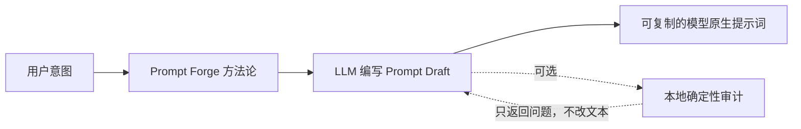

# Prompt Forge 独立化与 Anima 方法论重写设计规格

**状态：** 已批准进入实施规划  
**日期：** 2026-08-13  
**范围：** Prompt Forge 的独立职责边界、Anima 文生图方法论、可选确定性审计工具，以及项目中现存的跨技能耦合清理  
**规范地位：** 本文是本次重写的唯一规范来源。此前的 Anima 分析、设计和实施文档只作为历史记录，不具有约束力。

## 1. 最终决策

Prompt Forge 是一个独立的提示词创作技能。它只负责把用户意图写成目标模型可使用的提示词，不负责调用、选择、约束或验证任何生图、生视频、相机、工作流或执行技能。

其他技能是否采用 Prompt Forge 生成的文本，完全由调用者决定。技能之间不存在依赖、握手、产物引用、质量门、运行时上下文哈希或推荐调用链。

必须满足以下零耦合规则：

- Prompt Forge 不导入 `camera-image`、`camera-video`、`camera-multiview` 或 MCP 执行模块。
- 其他技能不导入 Prompt Forge，不调用其函数，不解析其审计结果。
- 其他技能不接受 `prompt_ref`、BuildLog ID 或 Prompt Forge artifact。
- 其他技能只接受调用者直接提供的模型原生 prompt 字符串或 prompt 字典。
- Prompt Forge 不读取工作流、LoRA 清单、采样器、seed、GPU、ComfyUI 或其他技能配置。
- Prompt Forge 输出的是可复制的普通文本；没有下游必须消费的签名或证书。
- 不保留旧跨技能兼容入口、转换器、feature flag、双轨模式或迁移桥。

Anima 方法论同时进行处女式重写：删除固定槽位、固定标签数量、强制五层审美、单句自然语言桥、静态复杂度预算和模板化 viewer 关系句，改成以视觉意图、主体绑定、关系表达和可验证图像质量为中心的方法。

## 2. 第一性原理

### 2.1 Prompt Forge 的产品就是文本

Prompt Forge 的输入是用户视觉或视频意图，输出是模型原生提示词。它的成功标准是：

1. 提示词忠实保留用户不可丢失的事实。
2. 主体、属性、动作和关系表达清楚。
3. 语言形式匹配目标模型。
4. 不引入无关模板词或未经请求的审美偏置。
5. 用户可以复制输出到任何兼容环境，不依赖项目内其他技能。

运行执行、工作流配置和图像下载不属于这个产品。

### 2.2 最终质量由图像验证，不能由格式自证

提示词只是控制模型的中间表示。标签数量、字段覆盖、字符串长度和“前重后轻”不能替代图像结果。真正的质量维度是：

- 必要事实遵循。
- 主体属性绑定。
- 动作、关系和空间成立。
- 审美连贯性。
- 伪影负担。
- 达到结果的试错成本。

因此，任何固定标签数和强制审美填充都不得成为规则。

### 2.3 创作判断和确定性判断必须分离

LLM 负责：

- 理解用户意图和缺失信息。
- 选择 Tag、Hybrid 或自然语言路线。
- 决定构图、光线、色彩、材质、风格和叙事重点。
- 写出主体关系、空间布局和因果动作。
- 根据生成失败提出最小提示词修正。

代码只负责：

- 查询受控标签词典。
- 解析 Anima 标签和权重语法。
- 应用 Base/Aesthetic/Turbo 的确定性协议差异。
- 检查显式重复、正负冲突和主体映射元数据。
- 精确计数 token。
- 生成中立评测清单并计算盲评分数。

代码不得创作、补齐、删减、压缩、排序或改写提示词。

### 2.4 独立技能不拥有调用链

文本可以被复制到另一个工具，不等于两个技能建立接口。独立性要求：

- Prompt Forge 不知道文本将被用在哪里。
- 下游工具不需要知道文本从哪里产生。
- 任意合法 prompt 和 Prompt Forge 输出在下游具有同等地位。
- Prompt Forge 的审计 warning 只服务于作者，不对下游形成门禁。

### 2.5 硬规则必须有确定性依据

只有以下内容可以成为 error：

- Anima 官方词法或 variant 明确禁止的形式。
- 请求内部的结构、引用或主体归属不变量。
- 显式正负语义冲突。
- 结构化安全约束。
- tokenizer 已证实的物理输入上限。

经验性质量风险必须是 warning 或方法论建议，不能阻止用户得到提示词。

## 3. 研究依据

| 资料 | 采纳结论 |
|---|---|
| [Anima 官方模型卡](https://huggingface.co/circlestone-labs/Anima) | 支持标签、自然语言和混合；普通标签使用空格；画师使用 `@`；纯 NL 至少两句；Aesthetic 不应使用 `score_*`；权重有效 |
| [Civitai 官方模型页](https://civitai.com/models/2458426/anima) | Base、Aesthetic、Turbo 需要区分；Turbo 适合低成本迭代 |
| [Base 官方混合示例](https://civitai.com/images/130697922) | 紧凑 Hybrid 与显式权重可行 |
| [Base 官方标签示例](https://civitai.com/images/130697920) | 画师主导和长标签流均可行，质量前缀不是唯一格式 |
| [Aesthetic 官方示例](https://civitai.com/images/136614294) | Aesthetic 不依赖 `score_*` |
| [权重讨论](https://huggingface.co/circlestone-labs/Anima/discussions/135) | 权重需通过单变量实验校准，不能规定统一画师区间 |
| [空间方向讨论](https://huggingface.co/circlestone-labs/Anima/discussions/99) | 多主体关系必须固定坐标系，标签与自然语言必须协同 |
| [区域提示讨论](https://huggingface.co/circlestone-labs/Anima/discussions/76) | 复杂分区存在 prompt-only 能力边界，应提醒用户改用外部控制，但 Prompt Forge 不调用该控制 |

Civitai 社区热度只用于发现候选模式。LoRA、放大、工作流和后期会混淆因果，因此点赞数不作为硬规则证据。

## 4. 目标与非目标

### 4.1 目标

- 建立零上下文 Agent 也能执行的 Anima 提示词方法论。
- 支持 `tag`、`hybrid`、`natural_language` 三条一等路线。
- 支持 Base、Aesthetic、Turbo 三个显式模型 profile。
- 保留用户事实并减少多主体属性串位。
- 默认输出可直接复制的 positive/negative 文本。
- 提供完全可选的本地词典、语法审计、token 计数和评测工具。
- 通过固定 brief 和盲评改进方法论，不让代码替代审美判断。
- 从项目中删除 Prompt Forge 与其他技能之间现存的所有耦合。

### 4.2 非目标

- 不执行或连接 ComfyUI。
- 不搜索、读取、修改或验证工作流。
- 不发现、选择、安装或验证 LoRA。
- 不控制 seed、采样器、CFG、步数、分辨率或相机节点。
- 不生成 BuildLog、prompt reference 或下游消费证书。
- 不要求任何生图或生视频技能使用 Prompt Forge。
- 不保证提示词能解决严格布局、区域风格、精确文字或复杂姿态。
- 本次不重写 MiniMax-H3 的提示词方法本身；只解除它与视频技能的消费关系。

## 5. 独立架构



图在输出结束，不再连接任何下游技能。

Prompt Forge 的默认人类可见输出：

```text
Positive prompt:
<model-native text>

Negative prompt:
<model-native text or empty>
```

MiniMax-H3 输出：

```text
Prompt:
<model-native text>
```

除非用户要求解释或审计，不附加内部结构、哈希、引用 ID 或执行说明。

## 6. Anima 方法论

### 6.1 Visual Brief

写提示词前，在推理中建立：

- 不可丢失事实。
- 主体列表和每个主体的身份、外观、服装、动作。
- 主体之间的关系与动作结果。
- 统一空间坐标系：viewer 或 scene。
- 环境和构图层级。
- 用户明确要求的审美目标。
- 用户排除项。
- prompt-only 可能无法稳定完成的控制需求。

Visual Brief 是创作方法，不是要求用户填写的表单。信息足够时直接生成；只有缺失内容会实质改变结果时才询问。

### 6.2 Route 选择

#### Tag

适用于单主体、已知角色、简单姿态和词典覆盖好的场景。使用标签表达身份、外观、动作和全局审美。

#### Hybrid（默认）

使用标签稳定人数、身份、角色、画师和外观锚点；使用自然语言描述多主体关系、空间、因果动作、复杂构图和难以标签化的氛围。

#### Natural Language

适用于非典型艺术形式、新颖材质逻辑、复杂画面结构或标签会损害语义的场景。使用正常英文大小写和至少两个完整句子。

### 6.3 内容层级

方法论使用语义层级，不使用强制槽位：

1. 最重要的全局信号。
2. 各主体身份和稳定锚点。
3. 动作、关系和空间。
4. 环境和构图。
5. 只有确实有助于意图的光线、色彩、材质和风格。
6. 精简、失败驱动的 negative。

层级不是固定模板。简单任务可以只用其中少数层。

### 6.4 多主体绑定

- 每个主体先写身份，再写属于它的外观和服装。
- 关系句明确点名双方，不使用含糊代词。
- viewer-left / viewer-right 与角色视角的 left/right 不混用。
- 因果动作写成起点、动作、可见结果。
- 标签和自然语言不得给同一人物互相矛盾的属性。

### 6.5 光线、色彩和风格

光线与色彩是可选的高价值控制，不是必须覆盖的检查表，也不是普遍禁止项。只有它们能服务用户意图时才写入。

跨世界观或风格混合不是错误。只检查混合是否有意、是否能用统一材质、色彩、构图或叙事逻辑连接。

### 6.6 Negative

- 从目标 variant 的官方精简基线开始。
- 加入用户明确排除项。
- 只有观察到具体失败时，才加入对应失败词。
- 不默认堆积通用人体错误清单。
- 不把 positive 中想要的语义同时放入 negative。
- Aesthetic 的 positive 和 negative 都不使用 `score_*`。

### 6.7 权重

- 默认不用权重。
- 某个关键语义持续丢失时才测试权重。
- 每次只改变一个权重，保持其余提示词和 seed 不变。
- 不规定通用画师权重范围。
- 多画师默认视为实验性组合，不自动拒绝。

### 6.8 Prompt-only 能力边界

遇到以下需求时给出提醒，但仍只返回提示词：

- 多区域各用不同风格。
- 严格指定多人精确位置。
- 精确肢体姿态。
- 可读文字或排版。
- 复杂遮挡和重复角色绑定。

提醒用户可能需要区域提示、姿态控制、布局参考或后期文字工具；Prompt Forge 不调用、配置或绑定这些工具。

## 7. 模型 Profiles

模型规则放在 `knowledge/anima/model-profiles.json`，只描述 Anima 自身，不包含工作流或其他技能信息。

### 7.1 Base

- ID：`anima-base-v1`
- `score_*` 允许。
- `masterpiece, best quality, score_7, safe` 是官方常用起点，不是强制前缀。
- 支持三条 route。

### 7.2 Aesthetic

- ID：`anima-aesthetic-v1`
- positive 和 negative 都禁止 `score_*`。
- `masterpiece` / `best quality` 可有可无，不自动添加。
- 支持三条 route。

### 7.3 Turbo

- ID：`anima-turbo-v1`
- 提示词协议按 Base 处理。
- 文档可以说明其适合低成本试稿，但不设置或执行采样参数。

## 8. 可选确定性审计

### 8.1 独立请求类型

```python
from dataclasses import dataclass
from typing import Literal

AnimaRoute = Literal["tag", "hybrid", "natural_language"]
ModelProfileId = Literal["anima-base-v1", "anima-aesthetic-v1", "anima-turbo-v1"]
AgeClass = Literal["adult", "minor", "unknown"]
ContentRating = Literal["safe", "sensitive", "nsfw", "explicit"]
CoordinateFrame = Literal["viewer", "scene"]
IntentOrigin = Literal["user_locked", "user_explicit", "necessary_inference", "embellishment"]
IntentKind = Literal[
    "count", "identity", "appearance", "wardrobe", "expression", "action",
    "relation", "spatial", "environment", "composition", "lighting", "palette",
    "style", "visible_text", "exclusion",
]
BlockRole = Literal["global", "subject", "relation", "environment", "aesthetic", "exclusion"]
BlockForm = Literal["tags", "prose"]

@dataclass(frozen=True)
class IntentClaim:
    claim_id: str
    text: str
    kind: IntentKind
    owner_ids: tuple[str, ...]
    origin: IntentOrigin
    required: bool

@dataclass(frozen=True)
class SubjectBrief:
    subject_id: str
    label: str
    age_class: AgeClass
    claim_ids: tuple[str, ...]

@dataclass(frozen=True)
class VisualBrief:
    subjects: tuple[SubjectBrief, ...]
    claims: tuple[IntentClaim, ...]
    content_rating: ContentRating
    consensual: bool | None
    coordinate_frame: CoordinateFrame | None

@dataclass(frozen=True)
class PromptBlock:
    block_id: str
    role: BlockRole
    form: BlockForm
    text: str
    claim_ids: tuple[str, ...]
    owner_ids: tuple[str, ...]

@dataclass(frozen=True)
class AnimaPromptDraft:
    model_profile_id: ModelProfileId
    route: AnimaRoute
    brief: VisualBrief
    positive_blocks: tuple[PromptBlock, ...]
    negative_blocks: tuple[PromptBlock, ...] = ()
    external_terms: tuple[str, ...] = ()

@dataclass(frozen=True)
class AnimaPromptOutput:
    positive: str
    negative: str

@dataclass(frozen=True)
class AnimaPromptAudit:
    output: AnimaPromptOutput
    findings: tuple[AuditFinding, ...]
    claim_coverage: dict[str, tuple[str, ...]]
    token_report: dict[str, int]
```

`external_terms` 只接受用户明确告知的自动注入词，用于避免作者重复；Prompt Forge 不主动发现其来源，也不保存工作流或技能身份。

### 8.2 唯一 Python interface

```python
def audit_anima_prompt(draft: AnimaPromptDraft) -> AnimaPromptAudit:
    ...
```

它只验证和格式化 LLM 已写好的 blocks，不生成新内容。返回的 `output` 保持原 block 顺序；任何 finding 都不改变输入文本。

### 8.3 Error codes

| Code | 确定性条件 |
|---|---|
| `invalid_draft` | 类型、ID、引用、枚举或数值不合法 |
| `route_shape_mismatch` | block 形式与 route 不一致 |
| `required_claim_uncovered` | required claim 未由正确流覆盖 |
| `owner_binding_missing` | claim 和 block 的主体映射矛盾 |
| `relation_requires_prose` | relation/spatial claim 没有 prose 实现 |
| `coordinate_frame_missing` | 多主体空间关系缺少统一坐标系 |
| `sexual_minor_or_unknown_age` | NSFW/explicit 包含 minor 或 unknown 主体 |
| `nonconsensual_explicit_content` | 多主体 NSFW/explicit 没有 `consensual=True` |
| `invalid_tag_syntax` | 标签保留命名空间、下划线或表达式错误 |
| `artist_prefix_missing` | 词典确认的画师缺少 `@` |
| `aesthetic_score_tag_forbidden` | Aesthetic positive/negative 含 `score_*` |
| `invalid_weight` | 权重非有限或不在防御范围 `0.01..10.0` |
| `duplicate_semantics` | 同一流存在确定性重复 |
| `external_term_collision` | 用户提供的 external term 与草稿重复 |
| `positive_negative_contradiction` | 正负流含相同确定性语义 |
| `physical_token_limit` | 超过 tokenizer manifest 声明的物理上限 |

### 8.4 Warning codes

| Code | 经验性条件 |
|---|---|
| `unverified_tag` | 标签未在词典精确解析 |
| `quality_prefix_absent` | Base/Turbo 未出现官方常用质量信号 |
| `safety_tag_absent` | rating 与提示词没有对应安全信号 |
| `weight_requires_experiment` | 使用显式权重 |
| `artist_mix_experimental` | 使用多个画师 |
| `visible_text_is_weak` | brief 要求可见文字 |
| `prompt_only_limit_risk` | 任务具有高布局、区域或绑定风险 |

审计返回全部 findings。即使有 error，也返回原样格式化的 prompt，让作者可以查看和自行改写；审计工具没有“拒绝下游执行”的能力。

## 9. 安全约束

- `safe` / `sensitive` 不要求年龄声明。
- `nsfw` / `explicit` 要求每个可见主体 `age_class == "adult"`。
- 多主体 `nsfw` / `explicit` 要求 `consensual is True`。
- 旧模板中涉及未成年人性化的示例、配方和词表不迁入新技能。
- 安全问题在审计中报告为 error，但 Prompt Forge 不与任何执行技能建立拦截关系。

## 10. 文件架构

```text
skills/prompt-forge/
├── SKILL.md
├── agents/openai.yaml
├── references/
│   ├── anima/
│   │   ├── visual-brief.md
│   │   ├── route-selection.md
│   │   ├── model-profiles.md
│   │   ├── multi-subject-spatial.md
│   │   ├── negative-and-weights.md
│   │   ├── failure-recovery.md
│   │   ├── examples.md
│   │   └── evaluation.md
│   └── minimax-h3/
│       ├── dialect.md
│       └── budget-policy.json
├── knowledge/
│   ├── anima/
│   │   ├── model-profiles.json
│   │   ├── protocol.json
│   │   ├── tags.sqlite
│   │   ├── manifest.json
│   │   └── sources.lock.json
│   └── tokenizers/
├── prompt_forge/
│   └── anima/
│       ├── contracts.py
│       ├── profiles.py
│       ├── tag_parser.py
│       ├── dictionary.py
│       ├── validation.py
│       ├── rendering.py
│       ├── audit.py
│       └── report.py
├── scripts/
│   ├── audit_anima_prompt.py
│   ├── anima_tag_lookup.py
│   ├── build_anima_eval_manifest.py
│   └── score_anima_eval.py
└── benchmarks/anima/
    ├── briefs.jsonl
    ├── candidates.schema.json
    ├── ratings.schema.json
    └── README.md
```

`SKILL.md` 少于 500 行，只保留核心方法和 references 路由。详细资料从 `SKILL.md` 一层直达，不建立深层引用链。

## 11. 必须删除的旧体系

### 11.1 Prompt Forge 内部

- `AnimaAuthoringRequest`
- Anima 使用的 `Complexity`
- `author_anima_prompt`
- `PromptArtifact` 作为 Anima 输出
- `protocol_prefix` 强制槽位
- `scene_description_count`
- `tag_bridge_fact_overlap`
- Anima `plan_anima_budget`
- Anima `compress_to_budget`
- 固定 tag-count ruler
- 强制五层审美检索
- 旧 vocabulary 和 recipe 目录
- `knowledge/aesthetics/`
- `scripts/preflight.py`
- 旧 Anima benchmark 和基线

H3 使用的 shared Fact、segments、预算、压缩和 tokenizer 保留。

### 11.2 跨技能耦合

删除：

- MCP `compile_prompt_artifact`、`get_build_audit`、`get_build_metadata`、`delete_prompt_build`。
- `mcp_server/engine/prompt_forge.py`。
- `mcp_server/engine/build_log.py`。
- `SkillData.prompt_gate_fn`。
- `engine.execute` 中的 Prompt Forge gate。
- `camera-image` / `camera-video` 的 `compile_prompt_gate`。
- `prompt_ref` envelope 字段和运行记录字段。
- 所有“必须先运行 Prompt Forge”或“verified PromptArtifact”的文档语言。

修改后：

- `camera-image` 接受且只接受 `{"prompt": {"positive": str, "negative": str}}`。
- `camera-video` 接受且只接受 `{"prompt": {"text": str}}`。
- 两者不验证来源，只验证 prompt 自身的字段和非空类型。
- `camera-multiview` 保持自身现有 prompt-free 设计。

## 12. 评测设计

### 12.1 静态评测

- 三条 route 的结构测试。
- Base/Aesthetic/Turbo 差异测试。
- 标签、权重、画师、score 和下划线测试。
- required claim、主体绑定和坐标系测试。
- 安全声明测试。
- 正负冲突和用户提供 external terms 测试。
- 确认审计不改写任何文本。
- 确认 Prompt Forge 源码不引用其他技能。
- 确认其他技能和 MCP 不引用 Prompt Forge、BuildLog 或 prompt_ref。

### 12.2 中立图像评测

使用六个固定 brief：单主体、双主体绑定、因果动作、分层空间、非典型纯 NL、刻意跨世界观混合。

评测工具只输出中立 JSON 清单：candidate ID、positive、negative、model profile、seed 和建议记录字段。它不调用任何项目技能或渲染器。调用者可以使用任意兼容环境渲染。

低成本上限：

- 每个 brief 两个候选。
- 每个候选最多两个固定 seed。
- 首轮最多 24 张。
- 若成本受限，使用每候选一个固定 seed，最多 12 张。
- 不删除失败结果，不用新 seed 替换失败。

### 12.3 盲评维度

每张图 0–4 分：

- 必要事实遵循。
- 主体属性绑定。
- 空间与动作关系。
- 审美连贯性。
- 伪影负担。

方法论发布门槛：

- required claim 的静态覆盖率 100%。
- 事实遵循和主体绑定最低分都不低于 3。
- 六个 brief 总分中位数至少 17/20。
- 相对官方最小基线，非平局盲选偏好率至少 60%。

## 13. 失败恢复

1. 身份丢失：增加或前移身份锚点。
2. 属性串人：拆分主体描述并明确关系双方。
3. 空间错误：统一坐标系并减少冲突方向词。
4. 动作不成立：写清起点、动作和结果。
5. 风格不足：只测试一个画师或一个权重变量。
6. 画面脏乱：删除低价值装饰，不机械裁剪到固定标签数。
7. 区域渗漏：提示 prompt-only 边界，不继续无限堆词。
8. 文字错误：提示文字专用工具或后期处理。

每次只改变一个最可能原因，用相同 seed 比较。Prompt Forge 只给出改写后的文本，不执行比较。

## 14. 发布与版本

- 项目版本统一提升到 `0.3.0`。
- 插件版本使用 `0.3.0+codex.20260813`。
- 修改技能源后运行 `scripts/install.ps1` 同步缓存。
- release verifier 必须检查新 Skill、references、Anima 审计模块、knowledge 和评测 schemas。
- release verifier 必须拒绝所有旧 Anima 路径和跨技能耦合符号。
- 源码与缓存不一致时发布失败。

## 15. 验收定义

只有同时满足以下条件才算完成：

- Prompt Forge 默认只输出模型原生提示词文本。
- Anima 新方法不含固定标签数、强制五层审美或单句桥。
- 可选审计保持文本原样，只返回 findings 和 token 信息。
- Prompt Forge 源码和文档不引用其他技能、工作流、ComfyUI 或 MCP 执行。
- 其他技能不引用 Prompt Forge、BuildLog、PromptArtifact 或 prompt_ref。
- 生图和视频技能接受调用者直接提供的任意合法模型原生 prompt。
- H3 提示词自身的回归测试通过。
- 所有离线测试和 release verifier 通过。
- 插件缓存与源码一致。
- 中立图像评测达到第 12.3 节门槛后，才声明 Anima 方法论质量验证完成。

